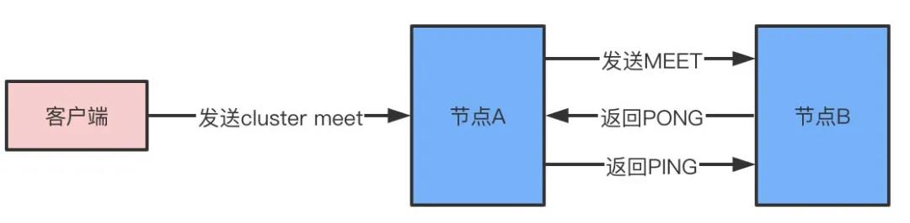
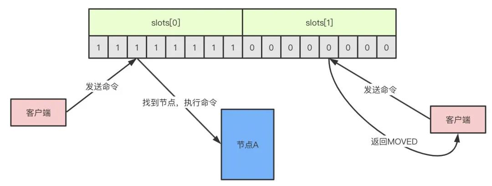

# Redis

# redis为什么快？⭐

- 完全基于内存操作
- 单线程，无上下文切换成本
- 非阻塞IO多路复用机制
- C语言实现，优化过的数据结构

# 五大数据结构

1. string
2. list
3. set
4. hash
5. zset

# 跳跃表

[看这个，很详细](https://developer.aliyun.com/article/723385)

跳跃表的原理简单，其查询、插入、删除的平均复杂度都为O(logN)。跳跃表主要应用于有序集合的底层实现。

# 缓存穿透、缓存击穿、缓存雪崩

[以下主要来源为](https://my.oschina.net/u/3194531/blog/4687545)

## 缓存穿透

缓存穿透是指查询一个一不存在的数据。例如：从缓存redis没有命中，需要从mysql数据库查询，查不到数据则不写入缓存，这将导致这个不存在的数据每次请求都要到数据库去查询，造成缓存穿透。

#### **解决办法：**

1）布隆过滤器

当用户想要查询的时候，使用布隆过滤器发现不在集合中，就直接丢弃，不再对持久层查询。

> 布隆过滤器的原理是在你存入数据的时候，会通过散列函数将它映射为一个位数组中的K个点，同时把他们置为1。这样当用户再次来查询A，而A在布隆过滤器值为0，直接返回，就不会产生穿透请求打到DB了。

2）缓存空对象

缓存中没有就回去存储层获取，此时即使数据库返回的空对象也将其缓存起来，同时会设置一个过期时间，之后再访问这个数据将会从缓存中获取

## 缓存击穿

缓存击穿是指一个key非常热点，在不停的扛着大并发，大并发集中对这一个点进行访问，当这个key在失效的瞬间，持续的大并发就穿破缓存，直接请求数据库，瞬间对数据库的访问压力增大。

#### 解决方法：

在查询缓存的时候和查询数据库的过程加锁，只能第一个进来的请求进行执行，当第一个请求把该数据放进缓存中，接下来的访问就会直接集中缓存，防止了缓存击穿。

## 缓存雪崩

缓存同一时间大面积的失效，从而导致所有请求都去查数据库，导致数据库CPU和内存负载过高，甚至宕机。

#### **解决方案：**

1）主从复制

2）根据一些关键数据进行自动降级

3）提前数据预热

4）设置不同的失效时间，可以在设置失效时间的时候加上一个随机值

# 数据一致性问题⭐⭐⭐

不管是先写MySQL数据库，再删除Redis缓存；还是先删除缓存，再写库，都有可能出现数据不一致的情况。举一个例子：（两种情况，都要认真思考，面试问到过的）

1.如果删除了缓存Redis，还没有来得及写库MySQL，另一个线程就来读取，发现缓存为空，则去数据库中读取数据写入缓存，此时缓存中为脏数据。

2.如果先写了库，在删除缓存前，写库的线程宕机了，没有删除掉缓存，则也会出现数据不一致情况。

怎么保证缓存一致性？：读直接去缓存读，没有的话就读数据库，写直接写数据库，然后失效缓存中对应的数据

## **第一种方案：延时双删策略+缓存超时设置**

在写库前后都进行redis.del(key)操作，并且设定合理的超时时间。

**具体的步骤就是：**

1）先删除缓存；

2）再写数据库；

3）休眠一段时间；

4）再次删除缓存。

**设置缓存过期时间**

所有的写操作以数据库为准，只要到达缓存过期时间，则后面的读请求自然会从数据库中读取新值然后回填缓存。也就是看到写请求就执行上面的策略。

## **第二种方案：异步更新缓存(基于订阅binlog的同步机制)**

（先看看，面试不要提）

MySQL binlog增量订阅消费+消息队列+增量数据更新到redis

一旦MySQL中产生了新的写入、更新、删除等操作，就可以把binlog相关的消息通过消息队列推送至Redis，Redis再根据binlog中的记录，对Redis进行更新。

# 过期key的删除策略⭐⭐

- **惰性删除：**惰性删除指的是当我们查询key的时候才对key进行检测，如果已经达到过期时间，则删除。显然，他有一个缺点就是如果这些过期的key没有被访问，那么他就一直无法被删除，而且一直占用内存。
- **定期删除：**定期删除指的是redis每隔一段时间对数据库做一次检查，删除里面的过期key。由于不可能对所有key去做轮询来删除，所以redis会每次随机取一些key去做检查和删除。

# key的内存淘汰策略⭐

假设redis每次定期随机查询key的时候没有删掉，这些key也没有做查询的话，就会导致这些key一直保存在redis里面无法被删除，这时候就会走到redis的内存淘汰机制。

1. volatile-lru：从已设置过期时间的key中，移出最近最少使用的key进行淘汰
2. volatile-ttl：从已设置过期时间的key中，移出将要过期的key
3. volatile-random：从已设置过期时间的key中随机选择key淘汰
4. allkeys-lru：从key中选择最近最少使用的进行淘汰
5. allkeys-random：从key中随机选择key进行淘汰
6. noeviction：当内存达到阈值的时候，新写入操作报错

# 持久化机制⭐

- RDB快照
- AOF只追加文件

# cluster 集群原理

支持高并发同时容纳海量的数据，那就需要redis集群。redis集群是redis提供的分布式数据存储方案，集群通过数据分片sharding来进行数据的共享，同时提供复制和故障转移的功能。

**节点**

一个redis集群由多个节点node组成，而多个node之间通过cluster meet命令来进行连接，节点的握手过程：

1. 节点A收到客户端的cluster meet命令
2. A根据收到的IP地址和端口号，向B发送一条meet消息
3. 节点B收到meet消息返回pong
4. A知道B收到了meet消息，返回一条ping消息，握手成功
5. 最后，节点A将会通过gossip协议把节点B的信息传播给集群中的其他节点，其他节点也将和B进行握手

**槽slot**

redis通过集群分片的形式来保存数据，整个集群数据库被分为16384个slot，集群中的每个节点可以处理0-16384个slot，当数据库16384个slot都有节点在处理时，集群处于上线状态，反之只要有一个slot没有得到处理都会处理下线状态。通过cluster addslots命令可以将slot指派给对应节点处理。

slot是一个位数组，数组的长度是16384/8=2048，而数组的每一位用1表示被节点处理，0表示不处理，如图所示的话表示A节点处理0-7的slot。

当客户端向节点发送命令，如果刚好找到slot属于当前节点，那么节点就执行命令，反之，则会返回一个MOVED命令到客户端指引客户端转向正确的节点。（MOVED过程是自动的）

​	如果增加或者移出节点，对于slot的重新分配也是非常方便的，redis提供了工具帮助实现slot的迁移，整个过程是完全在线的，不需要停止服务。

**故障转移**

如果节点A向节点B发送ping消息，节点B没有在规定的时间内响应pong，那么节点A会标记节点B为pfail疑似下线状态，同时把B的状态通过消息的形式发送给其他节点，如果超过半数以上的节点都标记B为pfail状态，B就会被标记为fail下线状态，此时将会发生故障转移，优先从复制数据较多的从节点选择一个成为主节点，并且接管下线节点的slot，整个过程和哨兵非常类似，都是基于Raft协议做选举。

# redis的热key问题

## **热Key的概念**

所谓热key问题就是，突然有几十万的请求去访问redis上的某个特定key。那么，这样会造成流量过于集中，达到物理网卡上限，从而导致这台redis的服务器宕机。那接下来这个key的请求，就会直接怼到你的数据库上，导致你的服务不可用。

## **怎么发现热key**

方法一:凭借业务经验，进行预估哪些是热key 其实这个方法还是挺有可行性的。比如某商品在做秒杀，那这个商品的key就可以判断出是热key。缺点很明显，并非所有业务都能预估出哪些key是热key。

方法二:在客户端进行收集 这个方式就是在操作redis之前，加入一行代码进行数据统计。那么这个数据统计的方式有很多种，也可以是给外部的通讯系统发送一个通知信息。缺点就是对客户端代码造成入侵。

方法三:在Proxy层做收集 有些集群架构是下面这样的，Proxy可以是Twemproxy，是统一的入口。可以在Proxy层做收集上报，但是缺点很明显，并非所有的redis集群架构都有proxy。

方法四:用redis自带命令

(1)monitor命令，该命令可以实时抓取出redis服务器接收到的命令，然后写代码统计出热key是啥。当然，也有现成的分析工具可以给你使用，比如redis-faina。但是该命令在高并发的条件下，有内存增暴增的隐患，还会降低redis的性能。

(2)hotkeys参数，redis 4.0.3提供了redis-cli的热点key发现功能，执行redis-cli时加上–hotkeys选项即可。但是该参数在执行的时候，如果key比较多，执行起来比较慢。

方法五:自己抓包评估

Redis客户端使用TCP协议与服务端进行交互，通信协议采用的是RESP。自己写程序监听端口，按照RESP协议规则解析数据，进行分析。缺点就是开发成本高，维护困难，有丢包可能性。

以上五种方案，各有优缺点。根据自己业务场景进行抉择即可。那么发现热key后，如何解决呢？

## **如何解决**

目前业内的方案有两种

(1)利用二级缓存 比如利用ehcache，或者一个HashMap都可以。在你发现热key以后，把热key加载到系统的JVM中。

针对这种热key请求，会直接从jvm中取，而不会走到redis层。假设此时有十万个针对同一个key的请求过来,如果没有本地缓存，这十万个请求就直接怼到同一台redis上了。

现在假设，你的应用层有50台机器，OK，你也有jvm缓存了。这十万个请求平均分散开来，每个机器有2000个请求，会从JVM中取到value值，然后返回数据。避免了十万个请求怼到同一台redis上的情形。

(2)备份热key 这个方案也很简单。不要让key走到同一台redis上不就行了。我们把这个key，在多个redis上都存一份不就好了。接下来，有热key请求进来的时候，我们就在有备份的redis上随机选取一台，进行访问取值，返回数据。

# 面试问题

[以下问题摘抄自](https://mp.weixin.qq.com/s/lUggNKSZIJZP9ykZ9qClXA)

1. redis为什么快？

   - 完全基于内存操作
   - 单线程，无上下文切换成本
   - 非阻塞IO多路复用机制
   - C语言实现，优化过的数据结构

2. 为什么Redis6.0之后又改用多线程呢?

   只是使用多线程来处理数据的读写和协议解析，执行命令还是使用单线程。

   这样做的目的是因为redis的性能瓶颈在于网络IO而非CPU，使用多线程能提升IO读写的效率，从而整体提高redis的性能。

3. **缓存穿透**

   查询不存在于缓存和DB中的数据。

   **解决：**

   加一层布隆过滤器。布隆过滤器的原理是在你存入数据的时候，会通过散列函数将它映射为一个位数组中的K个点，同时把他们置为1。这样当用户再次来查询A，而A在布隆过滤器值为0，直接返回，就不会产生击穿请求打到DB了。

4. **缓存击穿**

   缓存击穿的概念就是单个key并发访问过高，过期时导致所有请求直接打到db上，这个和热key的问题比较类似，只是说的点在于过期导致请求全部打到DB上而已。

   **解决：**

   1. 加锁更新，比如请求查询A，发现缓存中没有，对A这个key加锁，同时去数据库查询数据，写入缓存，再返回给用户，这样后面的请求就可以从缓存中拿到数据了。
   2. 将过期时间组合写在value中，通过异步的方式不断的刷新过期时间，防止此类现象。

5. **缓存雪崩**

   当某一时刻发生大规模的缓存失效的情况，比如你的缓存服务宕机了，会有大量的请求进来直接打到DB上，这样可能导致整个系统的崩溃，称为雪崩。雪崩和击穿、热key的问题不太一样的是，他是指大规模的缓存都过期失效了。

   **解决：**

   1. 针对不同key设置不同的过期时间，避免同时过期
   2. 限流，如果redis宕机，可以限流，避免同时刻大量请求打崩DB
   3. 二级缓存，同热key的方案。

6. 过期key的删除策略

   - **惰性删除：**惰性删除指的是当我们查询key的时候才对key进行检测，如果已经达到过期时间，则删除。显然，他有一个缺点就是如果这些过期的key没有被访问，那么他就一直无法被删除，而且一直占用内存。
   - **定期删除：**定期删除指的是redis每隔一段时间对数据库做一次检查，删除里面的过期key。由于不可能对所有key去做轮询来删除，所以redis会每次随机取一些key去做检查和删除。

7. 内存淘汰机制

   假设redis每次定期随机查询key的时候没有删掉，这些key也没有做查询的话，就会导致这些key一直保存在redis里面无法被删除，这时候就会走到redis的内存淘汰机制。

   1. volatile-lru：从已设置过期时间的key中，移出最近最少使用的key进行淘汰
   2. volatile-ttl：从已设置过期时间的key中，移出将要过期的key
   3. volatile-random：从已设置过期时间的key中随机选择key淘汰
   4. allkeys-lru：从key中选择最近最少使用的进行淘汰
   5. allkeys-random：从key中随机选择key进行淘汰
   6. noeviction：当内存达到阈值的时候，新写入操作报错

8. 持久化机制

   - RDB快照
   - AOF只追加文件

9. **redis集群的原理**

   支持高并发同时容纳海量的数据，那就需要redis集群。redis集群是redis提供的分布式数据存储方案，集群通过数据分片sharding来进行数据的共享，同时提供复制和故障转移的功能。

   **节点**

   一个redis集群由多个节点node组成，而多个node之间通过cluster meet命令来进行连接，节点的握手过程：

   1. 节点A收到客户端的cluster meet命令
   2. A根据收到的IP地址和端口号，向B发送一条meet消息
   3. 节点B收到meet消息返回pong
   4. A知道B收到了meet消息，返回一条ping消息，握手成功
   5. 最后，节点A将会通过gossip协议把节点B的信息传播给集群中的其他节点，其他节点也将和B进行握手

   

   **槽slot**

   redis通过集群分片的形式来保存数据，整个集群数据库被分为16384个slot，集群中的每个节点可以处理0-16384个slot，当数据库16384个slot都有节点在处理时，集群处于上线状态，反之只要有一个slot没有得到处理都会处理下线状态。通过cluster addslots命令可以将slot指派给对应节点处理。

   slot是一个位数组，数组的长度是16384/8=2048，而数组的每一位用1表示被节点处理，0表示不处理，如图所示的话表示A节点处理0-7的slot。

   

   当客户端向节点发送命令，如果刚好找到slot属于当前节点，那么节点就执行命令，反之，则会返回一个MOVED命令到客户端指引客户端转向正确的节点。（MOVED过程是自动的）

   

   ​	如果增加或者移出节点，对于slot的重新分配也是非常方便的，redis提供了工具帮助实现slot的迁移，整个过程是完全在线的，不需要停止服务。

   **故障转移**

   如果节点A向节点B发送ping消息，节点B没有在规定的时间内响应pong，那么节点A会标记节点B为pfail疑似下线状态，同时把B的状态通过消息的形式发送给其他节点，如果超过半数以上的节点都标记B为pfail状态，B就会被标记为fail下线状态，此时将会发生故障转移，优先从复制数据较多的从节点选择一个成为主节点，并且接管下线节点的slot，整个过程和哨兵非常类似，都是基于Raft协议做选举。

10. Redis事务机制