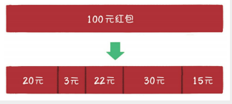

# 1. 蚂蚁金服一面（实习）

时间2020.4.17

最早的一个面试，表现很差，从此开始好好准备的

- 自我介绍

- 获得什么奖

- 实习的工作

  1）管理平台，用于什么场景

  2）学到了什么（面临的挑战是什么，困难点）

- ArrayList与LinkedList的区别

  1）实现方式。扩容机制的区别

  2）查询的时间复杂度

-  HashMap的key能不能放自定义的对象（能，重写equals()与hashCode()方法）

- 生产者消费者（多线程）

- 加锁synchronized

  1) 锁类中的一个同步方法，其他非方法能不能访问

  2) 静态方法能不能用synchronized

- 算法

  旋转数组找最小值

  思路：二分法查找

  ~~~Java
      /**
       * 思路：二分查找
       * 每次比对前后端点的大小
       * 4 5 6 7 1 2 3
       * @param arr
       * @return
       */
      public static int fun(int[] arr) {
          int l = 0, r = arr.length-1;
          int mid = l;
          //当左指针大于右指针时才循环,解决已经有序的情况
          while (arr[l] >= arr[r]) {
              if (l<r-1){
                  //终止条件是两个指针相邻
                  mid = r;
                  break;
              }
              mid = (r + l) / 2;
              int tmp = arr[mid];
              if (tmp >= arr[l]){
                  //说明此时最小值在mid位置右边
                  //左边界右移
                  l = mid;
              }else if (tmp <= arr[r]){
                  //说明此时最小值在mid位置的左边
                  r = mid;
              }
          }
          return arr[mid];
      }
  ~~~

# 2. 来伊份（实习）

很水的一次

set，map，list的增删改查的具体的函数

# 3. 恒生电子（实习）

- MySQL的分页实现

  limit

- jdbc与mybatis的区别

# 4. 农业银行研发中心（实习）

- java 集和介绍
- set与list的区别
- ArrayList与LinkedList的区别
- springMVC的注解有哪些
- 输入一个url之后发生了什么？

# 1. 字节跳动

## 字节北京测试（实习）

- redis与MySQL的区别

- 输入一个url之后发生了什么？

  DNS解析的详情

  怎么把域名一步一步解析成IP

- 请求js与请求JSON数据的区别

- HTTP

  content-type中定义的是什么

  cookie、session、sessionid 与jsessionid

- 项目

  登录验证怎么实现的？一直试密码？

  日志记录怎么实现的？

  ​	日志写到数据库中？，操作日志，记录用户所作的操作

  ​	日志规范是什么

- 数据库索引的作用，索引有什么缺点

- 实现项目的服务端如何实现并发

- 进程和线程的区别

- 数组和链表有什么区别，链表可以方便扩容，数组容量不可变

- 3道算法

  1）判断单向链表有没有环（力扣）

  ​	答：快慢指针

  ​			一次走几步比较合适

  ​			快指针走两步？为什么，三步行不行

  ~~~java 
      /**
       * 思路
       * 快慢指针，快指针一次走两步，慢指针一次走一步
       * @param head
       * @return
       */
      public static boolean fun(ListNode head){
          ListNode fast = head.next;
          ListNode slow = head;
          while (fast != null && fast.next != null){
              if (fast == slow){
                  return true;
              }
              fast = fast.next.next;
              slow = slow.next;
          }
          return false;
      }
  ~~~

  

  2）数组中找出所有和为0的三个数的不重复组合（力扣15题）

  方法1：暴力，三层循环

  方法2：排序+双指针

  ~~~java
      /**
       * 排序+双指针
       * 优化操作在于当第一个数大于0时，直接break掉，因为不会有满足的组合数
       * @param nums
       * @return
       */
      public List<List<Integer>> threeSum1(int[] nums) {
          Arrays.sort(nums);
          List<List<Integer>> res = new ArrayList<>();
          for(int k = 0; k < nums.length - 2; k++){
              if(nums[k] > 0) break;
              /*这里设计的很精妙，只有当k>0的时候才去判断要不要比较去重*/
              if(k > 0 && nums[k] == nums[k - 1]) continue;
              int i = k + 1, j = nums.length - 1;
              while(i < j){
                  int sum = nums[k] + nums[i] + nums[j];
                  if(sum < 0){
                      while(i < j && nums[i] == nums[++i]);
                  } else if (sum > 0) {
                      while(i < j && nums[j] == nums[--j]);
                  } else {
                      res.add(new ArrayList<Integer>(Arrays.asList(nums[k], nums[i], nums[j])));
                      while(i < j && nums[i] == nums[++i]);
                      while(i < j && nums[j] == nums[--j]);
                  }
              }
          }
          return res;
      }
  ~~~

  

  3）将N元人民币随机分成M个红包，其中N和M为整数，每个红包的最小单位为0.01元

  搜到一个讲解的算法描述https://www.cnblogs.com/alimayun/p/12795698.html

  - 二倍均值法  

    **每次抢到的金额 = 随机区间 [0.01，m /n × 2 - 0.01]元**

    这个公式，保证了每次随机金额的平均值是相等的，不会因为抢红包的先后顺序而造成不公平。

    **举个例子如下：**

    假设有5个人，红包总额100元。100÷5×2 = 40，所以第1个人抢到的金额随机范围是[0.01，39.99]元，在正常情况下，平均可以抢到20元。假设第1个人随机抢到了20元，那么剩余金额是80元。80÷4×2 = 40，所以第2个人抢到的金额的随机范围同样是[0.01，39.99]元，在正常的情况下，还是平均可以抢到20元。假设第2个人随机抢到了20元，那么剩余金额是60元。60÷3×2 = 40，所以第3个人抢到的金额的随机范围同样是[0.01，39.99]元，平均可以抢到20元。以此类推，每一次抢到金额随机范围的均值是相等的。

    **缺点：**这个方法虽然公平，但也存在局限性，即除最后一次外，其他每次抢到的金额都要小于剩余人均金额的2倍，并不是完全自由地随机抢红包。

  - 线段切割法

    何谓线段切割法？我们可以把红包总金额想象成一条很长的线段，而每个人抢到的金额，则是这条主线段所拆分出的若干子线段。

    

    当N个人一起抢红包的时候，就需要确定N-1个切割点。

    因此，当N个人一起抢总金额为M的红包时，我们需要做N-1次随机运算，以此确定N-1个切割点。

    随机的范围区间是（1， M）。当所有切割点确定以后，子线段的长度也随之确定。这样每个人来抢红包的时候，只需要顺次领取与子线段长度等价的红包金额即可。

## 北京字节测开（提前批）

  - 进程间的通讯

  - 输入URL之后发生了什么

  - 三次握手，四次挥手

  - SQL排序，查找前30个数据

  - 死锁的了解，怎么解决（四个必要条件）

  - get和post的区别

  - 数据库索引连接以及使用

  - 算法：

    数组中查找峰值，即比前一个大，又比后一个大，需要考虑到峰值在首尾的情况数据库索引连接以及使用（力扣162）

    方法1：简单粗暴

    - 时间复杂度 : O(n)。 我们对长度为 n 的数组 nums只进行一次遍历。
    - 空间复杂度 : O(1)。 只使用了常数空间。

    ~~~Java
    public int findPeakElement(int[] nums) {
            for (int i = 0; i < nums.length - 1; i++) {
                if (nums[i] > nums[i + 1])
                    return i;
            }
            return nums.length - 1;
    }
    
    ~~~

    方法2：递归二分

    ~~~java
        public int findPeakElement(int[] nums) {
            return search(nums, 0, nums.length - 1);
        }
        public int search(int[] nums, int l, int r) {
            if (l == r)
                return l;
            int mid = (l + r) / 2;
            if (nums[mid] > nums[mid + 1])
                return search(nums, l, mid);
            return search(nums, mid + 1, r);
        }
    ~~~

    方法3：迭代二分

    ~~~Java
        public int findPeakElement(int[] nums) {
            int l = 0, r = nums.length - 1;
            while (l < r) {
                int mid = (l + r) / 2;
                if (nums[mid] > nums[mid + 1])
                    r = mid;
                else
                    l = mid + 1;
            }
            return l;
        }
    ~~~

## 北京字节后端（正式批）

面试效果最好的一次

- 算法题

  数组中找出所有和为0的三个数的不重复组合（力扣15题）

  和上边的重复，还好当时做出来了。。复盘很重要啊。。

- 线程池主要参数有哪些

- 线程池的基础线程数为10，最大线程数是100，什么情况下线程数会达到11

- 锁升级过程

- 场景题，当时很懵，应该是多线程编程中的那个Callable()接口的问题，没回答好

  主线程要阻塞等待3个线程执行完毕拿到返回结果再去执行，用什么方法，怎么编程

- springAOP实现的原理（动态代理，反射）

- spring解决循环依赖的方法（三级缓存什么时候会失效）

  https://cloud.tencent.com/developer/article/1497692

- springMVC流程

- filter与拦截器的区别（答出来的太少了，问我还有呢。。）

  https://blog.csdn.net/reggergdsg/article/details/52962774

- MySQL索引（聚簇索引和非聚簇索引的区别）

- MVCC多版本并发控制

## 字节后端二面（正式批）

时间2020.9.11

- 测开与后端的区别（回答的开发业务软件与开发测试软件）

- 发展规划

- 智力题：（第一次遇到智力题，有点懵）

  9个人分糖果，通过掷色子的方式，如何分次数最少，分到的概率相同

- 算法题：

  两个字符串的最长重复子串（和力扣上的不一样）

  ~~~Java
      /**
       * 判断一个子串是不是在另一个长串内
       *
       * @param s1
       * @param s2
       * @return
       */
      public static String fun(String s1,String s2){
          //保证s1长度小于s2
          if (s1.length()>s2.length()){
              return fun(s2,s1);
          }
          for (int i = 0; i < s1.length(); i++) {
              //从最长的串开始取，每次长度缩小一点
              for (int l = 0,r = s1.length()-i; r != s1.length()+1; l++,r++) {
                  //判断子串是不是包含在长串里
                  String str = s1.substring(l,r);
                  if (s2.contains(str)){
                      return str;
                  }
              }
          }
          return "";
      }
  ~~~

- http与https协议的区别

- redis

  问的比较深，zset实现，跳跃表

  具体是什么样的结构

  怎么确定的层数

  一直是单线程的情况吗？

- 为什么考虑字节跳动

## 字节企业应用测开一面（正式批）

时间2020.9.22

- 算法

  给出一个字符数组，['a','d','h','j']，给一个字符串str: wewewewewewewrrgdsfgsgffs
  判断由字符数组组成的字符串是不是存在于字符串中，如果存在就返回true，不存在就返回false

  面试官说可以用滑动窗口

- 项目中的难点，遇到什么困难，怎么解决的

- 并发与死锁

  Java并发机制

  发生死锁怎么解决

  .实际发生死锁时，怎么去排查定位（不会 啊。。）

- Java垃圾回收

  没有足够空间放上一次年轻代生存下来的对象，会怎么做

  Java垃圾回收算法

  永久代的概念

- 应用层的协议了解哪些

- http与https协议的区别

- session和cookie的区别

  生命周期，哪个保存的时间长一点，哪个是会话期间的

- mySql的存储引擎

- SQL编写

  每个班每个科目分数最高的学生姓名

  ~~~sql
  select  t1.hscore,t1.subject,t1.classid,t2.classname,t3.studentid 
  from
  (select MAX(A.score) HScore,A.Subject,B.ClassID from Score A inner join Student b on A.StudentID =b.StudentID group by A.Subject,B.classid) t1
  inner join Class t2 on t1.ClassID=t2.ClassID
  inner join score t3  on t1.Subject=t3.Subject and t1.HScore=t3.Score
  inner join Student t4 on t3.StudentID=t4.StudentID
  order by t2.ClassName,t1.Subject
  ~~~

  

- 页面突然间打不开了怎么去定位问题？

## 字节企业应用测开二面（正式批）

时间2020.9.29

- 在实验室里的方向？

- 毕业课题？

- 在实验室里写过什么代码？

- 选一个项目讲一下

  几个人开发，大概做了多久

  怎么测试的

  ​	测试的方式，场景

  ​	数据校验分哪几种场景

- 收获更大的实习经历

- 性能测试有没有涉及（没有）

- 自动化测试有吗（没有）

- 自测时候自己是如何发现问题的？

- 通常用哪些工具做问题定位？

- 测试的方法论

  遇到问题先做什么判断

  用什么工具辅助分析

- TCP与UDP的区别

- 线程同步机制

- 项目里涉及到多线程了吗？

- DNS域名解析

- 如何防止域名劫持？

- 算法

  两个单链表。一个升序。一个降序，合并成一个有序链表（相当于先链表反转再合并有序链表）（剑指offer 25）

  ~~~java
      public ListNode mergeTwoLists(ListNode l1, ListNode l2) {
          ListNode dum = new ListNode(0), cur = dum;
          while(l1 != null && l2 != null) {
              if(l1.val < l2.val) {
                  cur.next = l1;
                  l1 = l1.next;
              }
              else {
                  cur.next = l2;
                  l2 = l2.next;
              }
              cur = cur.next;
          }
          cur.next = l1 != null ? l1 : l2;
          return dum.next;
      }
  ~~~

  

  判断链表中是否有环（字节实习面试的时候问过）

  ~~~Java
      /**
       * 思路
       * 快慢指针，快指针一次走两步，慢指针一次走一步
       * @param head
       * @return
       */
      public static boolean fun(ListNode head){
          ListNode fast = head.next;
          ListNode slow = head;
          while (fast != null && fast.next != null){
              if (fast == slow){
                  return true;
              }
              fast = fast.next.next;
              slow = slow.next;
          }
          return false;
      }
  ~~~

  

- 看抖音视频点赞失败可能什么原因引起的？

- 最近看的什么方面的书。看书的过程中最大的收获是什么

- 看过国内外互联网的一些文章或公众号吗？

- 发展方向

- 测试开发做什么 的了解吗？

- 对测试程序更感兴趣还是工具平台的开发更感兴趣？

## 字节测开三面（正式批）

时间2020.09.30

技术问题很少，基本在聊天，许愿HR面

- 数据库索引与优化
- tomcat配置
- jdk1.7与1.8的区别
- 多线程

# 2. 科大讯飞一面（挺可惜的）

时间2020.8.13

- 项目中的问题

- 管理系统设计需要考虑哪些方面

- 项目中使用的框架

- 框架与传统的代码相比有什么优势

- 设计模式知道哪些

  单例模式与工厂模式的区别

- 多线程

  保证多线程安全的方法有哪些

  同步代码块和锁机制的底层实现有什么区别

  多线程的好处和不好的地方

  线程池配置使用

  多线程通讯的方法

- 进程间通讯

- DNS解析

  DNS解析过程

  根域名服务器中国有没有

  DNS解析算法

  ​	递归解析

  ​	迭代解析

- linux命令用过哪些

- 数据库索引的原理（实现吗？）

- 聚簇索引和非聚簇索引

- SQL语句执行的慢怎么找问题（这个需要再看看）

- 设计一个OOM溢出模型（其实就是怎么会溢出吧）

# 3. 京东

## 京东数科一面

时间9.1号

- 实习工作或者项目中面对的比较棘手的地方，或者说对自己有提高的地方

- 两个微服务，操作同一个数据库信息，保证数据的同步并发（场景题）（分布式锁吧）

- MySQL的锁具体怎么用

- 场景，加钱比较多，减钱比较少的情况下，怎么保证安全的前提下提高性能（场景）

  使用读写锁，读写锁是一种适合读多写少的场景下解决线程安全问题的工具

  ReentrantReadWriteLock：重入读写锁，它实现了ReadWriteLock接口，在这个类中维护了两个锁，一个是ReadLock，一个是WriteLock，他们都分别实现了Lock接口。

  基本原则是：`读和读不互斥、读和写互斥、写和写互斥`。也就是说涉及到影响数据变化的操作都会存在互斥。

- 建立索引的原则（总结一下）

- redis过期策略（想问LRU的）

  过期key删除策略

  - **惰性删除：**惰性删除指的是当我们查询key的时候才对key进行检测，如果已经达到过期时间，则删除。显然，他有一个缺点就是如果这些过期的key没有被访问，那么他就一直无法被删除，而且一直占用内存。
  - **定期删除：**定期删除指的是redis每隔一段时间对数据库做一次检查，删除里面的过期key。由于不可能对所有key去做轮询来删除，所以redis会每次随机取一些key去做检查和删除。

  key的内存淘汰策略

- 算法

  数组和已知，其中有几个位置的数，未知的用？表示，问这几个位置的组合方式有多少种

- 使用自定义类作为HashMap的key要进行什么操作

  重写hashCode和equals方法

- 设计模式

- Spring

- 内存溢出

- 多线程的使用场景

## 京东数科二面

时间9.4号

- 介绍一下自己熟悉的项目
- WEB-INF和META-INF的目录下分别是存放的什么
- token里面记录了哪些信息
- jwt认证的原理
- 为什么用JWT
- 操作日志都存了什么，更改前后的数据，url
- 操作日志里的信息怎么做转换的，怎么拦截入参
- 京东买东西的流程用什么样的设计模式设计最契合这个流程
- 商城活动中有几种，满减，打折，送积分...
- 写一个能处理高并发场景的接口，要怎么设计处理
- 设计模式的六大原则
- redis为什么那么快
- CAS
- spring处理事务的时候事务能嵌套吗？怎么嵌套的
- in和limit有啥区别
- 有序的map有哪些？
- 线程安全的map有哪些？
- IO
- Java反射的原理
- 对象拷贝
- 怎么去序列化
- 为什么要序列化
- 对象比较，equals相等hashcode是不是一定相等
- MQ了解吗
- 介绍自己最近一天的生活，最近在学习什么知识

## 京东复活技术中台一面

时间9.9

- @Log怎么实现的
- 通知类型
- 日志里记录了什么东西
- mybatis和spring以及mybatis和sprintBoot结合的区别
- 显示控制事务的方式
- String能继承吗？字符串相加的底层优化实现
- String是基础类型吗?底层是字符数组实现
- StringBuilder和StringBuffer的区别
- ArrayList内的对象进行排序怎么做，Comparator接口
- 数据库连接池用过哪些?
- tomcat怎么分发请求的，线程工作模型是什么？（再看看，总结一下）
- springMVC流程，MVC分别代表什么？
- spring自动协商视图（不会）
- spring不使用注解，不使用XML，如何暴漏一个自定义的对象成为spring的bean，用在上下文中
- redis缓存中有就写，没有就不写的命令setnx啊啊。。
- 持久化的方式
- zset数据结构
- 设计模式的六大原则
- 线程池的参数，设置原则（CPU密集，IO密集）
- 为什么会发生GC 
- 一次GC的过程
- jar包，静态信息，常量是放在哪里的
- 元空间占满之后会发生什么情况
- 从本地的A分支的某个提交拿到B分支来用，怎么操作
- war包部署到远程服务器，并启动的命令
- Linux文件上传
- liunx的scp命令

#  4. 拼多多

- topK问题，思路，时间复杂度
- 数据库中的两种索引？两者的区别
- Java内存模型
- 多线程中线程池的参数
- 线程池里怎么决定用多少线程数

# 5. 海康威视

## 海康威视一面（电话面）

时间9.14

- 接口与抽象类的区别
- ACID
- 项目介绍
- Linux命令
- finally的作用
- 异常处理怎么做的
- 线程池的状态，参数

## 海康威视二面（视频面）

时间9.17

- 什么时候开始学Java的

- Java集和介绍

  hashmap的底层实现

  怎么实现线程安全

- 线程池

  怎么用的，用过哪些

- spring与springboot的加载与运行的区别

- 搭建springboot环境遇到什么困难吗？

- maven使用过什么命令，使用工具还是命令？

## 海康威视现场面

时间9.27

纯HR面问题

- 家里对工作地点的看法

- 有几个offer了

# 6. 中金所

凉凉的

- 项目介绍

  事务隔离级别

  事务实现的原理

  MySQL的默认隔离级别

  MySQL解决了innodb引擎的幻读问题了吗？解决了，通过间隙锁和MVCC控制解决

- A类无事务注解方法调用B类有事务注解方法事务会生效吗？会生效，同一个类的普通方法调用事务注解方法时是不能生效的，相当于调用了一个普通方法。事务是通过动态代理实现的。

- 笔试没有做出来的题目现在会了吗？（那一天4场笔试，没来得及复盘，吃了海投的亏）

- 本科和研究生都是非计算机的，为什么现在做Java

- 未来的行业规划与城市安排

# 7. vivoJAVA（安卓方向）

直接没结果，后来收到感谢信

- 项目中遇到的最大的挑战
- 有没有遇到性能方面的问题
- 商城后台系统的优势
- 异常处理的方法，流程
- 设计模式的六大原则

# 8. 中兴

## 一面视频面

- 奖学金几等，成绩排名
- Java集合类
- java异常的了解
- 线上有问题，线下无法复现，log日志中没有，该怎么处理（不会。。。）
- 冒泡排序和插入排序的流程和第一次排序的结果，也就是第一个元素是最大或最小的吗？排序算法的时间复杂度要多记多看。
- 静态代码块和普通代码以及构造函数的初始化执行顺序
- 项目介绍以及项目中遇到的困难点，怎么解决的？
- 1到n，每次遇到7的倍数或者含有7的数字跳过，出几个测试用例

## 二面综合面

- 为什么学软件
- 期望薪资

# 9. 好未来

时间是9.19，连续面试，只走到了二面，可惜。。

## 一面电话面

- mysql中原生命令实现事务控制

- Java中常见的修饰符，方法多线程同步用什么修饰 

- Java中的集和都有哪些？map的实现类

- Java创建线程的方法

- 泛型介绍

  在JVM中的实现

  编译时还是运行时？泛型只在编译阶段有效

  泛型的类型参数只能是类类型（包括自定义类），不能是简单类型

- 算法

  两个字符串的最长重复子串

  **==重复出现了啊==** 同字节后端二面

- SQL语句的优化

  索引怎么设计？一般怎么建立索引？在哪些列建立索引？

  查询语句有哪些注意的地方

- 用户名建立主键索引会出现什么问题

- 新增数据，索引怎么更新

- 主键索引怎么存储的？叶子节点是指向真实数据的指针？

- 组合索引

  最左原则

  

- explain？关注哪些返回值

- redis

  cluster怎么实现的

  常用的有哪种结构

  字符串设置超时时间，时间到了会立即回收吗？

  ​	定时的怎么实现的

  ​	定时任务会阻塞正常的读写流程吗

  redisServer里的实现

  多路IO怎么实现的

  系统调用

  epoll

  缓存穿透

- netty怎么实现的
  
- 操作系统的基础知识

  内存分配原理

  32位和64位操作系统有啥区别?代表 寻址位数

  同步异步阻塞非阻塞?分别是什么意思

  Linux中的系统调用是同步的还是异步 的

- TCP

  time_wait

  怎么保证传输可靠

## 二面

一道SQL，一道算法，没做出来，挂了

- 算法题

  求一个数组中和为target的全部组合（力扣[39. 组合总和](https://leetcode-cn.com/problems/combination-sum/)）

# 10. 有赞

## 一面（电话面）

- 介绍spring IOC与AOP

- 线程间同步有哪几种机制

- 垃圾回收算法，CMS与G1的区别和优势

- redis怎么保证数据一致性的，缓存更新策略（这个很重要）

- rediskey失效时大量请求来了，直接请求数据库，怎么办？（还不知道）

- 堆排序的过程？怎么构建堆

- 算法

  和最大的子序列（力扣[剑指 Offer 42. 连续子数组的最大和](https://leetcode-cn.com/problems/lian-xu-zi-shu-zu-de-zui-da-he-lcof/)）

  方法1：滑动窗口

  ~~~java 
      /**
       * 滑动窗口
       *
       * @param nums
       * @return
       */
      public static int maxSubArray(int[] nums) {
          int sum = 0;
          int max = Integer.MIN_VALUE;
          for (int i = 0; i < nums.length; i++) {
              if (sum<0){
                  sum = nums[i];
              }else {
                  sum += nums[i];
              }
              max = Math.max(max,sum);
          }
          return max;
      }
  ~~~

  方法2：动态规划

  ~~~Java
      public int maxSubArray(int[] nums) {
          int res = nums[0];
          for(int i = 1; i < nums.length; i++) {
              nums[i] += Math.max(nums[i - 1], 0);
              res = Math.max(res, nums[i]);
          }
          return res;
      }
  ~~~

  

- TCP三次握手，四次挥手?问什么需要四次挥手?

## 二面（微信视频）

挂在了数据库索引和AOP上，懵了

- 项目横向越权解决的什么问题
- AOP怎么实现的，spring哪里用到AOP？（这个要好好看啊。。。）
- 主键索引和组合索引在B+Tree上分别怎么存的https://www.cnblogs.com/ibigboy/p/12373978.html
- 叶子节点的链表是单向的还是双向的（双向的）
- 范围查询怎么样的过程
- 最左匹配原则
- 已有a索引，有b字段，where b =1 and a = 1 会生效吗? (会生效的。。)
- <匹配怎么进行查找的

# 11. 美的

- Java集和

- ThreadLocal，用在哪里

- GC的算法

- 堆和栈的区别

- jvm参数中哪个设置的栈（Xss）

- NIO ,BIO ,AIO

- MySQL引擎，二者的区别

- ACID详细介绍

- 什么是数据库事务

- 什么是数据库的锁

- 数据库连接池的参数

- Linux命令

  ssh连接命令

  scp

  查找grep

  查看系统几个cpu

  查看系统资源占用状态

# 12. 华为

一共三面，问的很少，主要是算法，整合在一起吧

算法集和

算法1：接雨水（力扣）感谢面试官不挂之恩

方法1：动态编程

~~~Java
public int trap(int[] height) {
    if (height == null || height.length == 0)
        return 0;
    int ans = 0;
    int size = height.length;
    int[] left_max = new int[size];
    int[] right_max = new int[size];
    left_max[0] = height[0];
    for (int i = 1; i < size; i++) {
        left_max[i] = Math.max(height[i], left_max[i - 1]);
    }
    right_max[size - 1] = height[size - 1];
    for (int i = size - 2; i >= 0; i--) {
        right_max[i] = Math.max(height[i], right_max[i + 1]);
    }
    for (int i = 1; i < size - 1; i++) {
        ans += Math.min(left_max[i], right_max[i]) - height[i];
    }
    return ans;
}
~~~

方法2：单调栈

~~~Java
    /**
     * 单调栈解法
     * 单调递减栈
     * 
     * @param height
     * @return
     */
    public int trap1(int[] height) {
        if (height == null) {
            return 0;
        }
        Stack<Integer> stack = new Stack<>();
        int ans = 0;
        for (int i = 0; i < height.length; i++) {
            while (!stack.isEmpty() && height[stack.peek()] < height[i]) {
                int curIdx = stack.pop();
                // 如果栈顶元素一直相等，那么全都pop出去，只留第一个。
                while (!stack.isEmpty() && height[stack.peek()] == height[curIdx]) {
                    stack.pop();
                }
                if (!stack.isEmpty()) {
                    int stackTop = stack.peek();
                    // stackTop此时指向的是此次接住的雨水的左边界的位置。右边界是当前的柱体，即i。
                    // Math.min(height[stackTop], height[i]) 是左右柱子高度的min，减去height[curIdx]就是雨水的高度。
                    // i - stackTop - 1 是雨水的宽度。
                    ans += (Math.min(height[stackTop], height[i]) - height[curIdx]) * (i - stackTop - 1);
                }
            }
            stack.add(i);
        }
        return ans;
    }
~~~


算法2：统计数组元素出现的次数，有出现次数相同的返回true，否则返回false（力扣原题）

  ~~~Java

  ~~~


# 13. VIPKID青少儿教育

## 一面

- 响应对象
- 横向越权问题
- 依据什么标准来分为在AOP处理和单独处理的
- 如何抽象出一个用户的所有信息
- redis在项目中主要用到哪些数据结构
- Java虚拟机的使用和JVM的结构
- 对spring的理解
- springCloud
- 关系型数据库和非关系数据库的理解
- redis中key的位置计算
- redis缓存的更新策略
- 数据操作如何消除数据的脏写，误更新
- 数据库SQL的优化方法
- explian命令
- mybatis中的注解以及标签
- 介绍实习或项目中的相关技术点和处理问题的方式
- 一致性hash操作
- redis分布式锁了解吗
- MQ
- 最近在看什么书？
- 过去的六个月面临的最大压力是什么，怎么处理的？
- 算法：数对和，双指针

# 14. 电信云

- token认证的知识，怎么防止token泄露
- Java常量池，Integer(100)与Integer(100)是否相等
- jdbc防止sql注入
- mybatis插入获取主键值（useGeneratedKeys="true" keyProperty="id"）
- 动态代理与静态代理的区别
- hashtable的方法哪些是加了synchronized
- 注解定义与应用的方法
- 全局异常处理的实现
- 响应对象包含哪些东西
- Linux文件句柄 数限制，最大支撑多少连接
- 传输层的tcp的MTU值是多少
- 商城项目中http用的什么版本
- http里哪些头域字段是自己设置的
- tcp的粘包和拆包
- linux抓包

# 15. 浙商银行

## 一面

- 数据库调优会吗？

- 哪些情况会造成OOM
- JVM调优会吗？

# 16. 农业银行

## 一面（腾讯视频）

- 响应对象怎么设计的？全局异常怎么设计的？
- 事务注解的实现？
- 前后端数据收发解析过程？
- 项目中遇到的困难？
- token认证怎么设计的，怎么验证的token？
- 用户信息放在redis里？
- 恒生能留用吗？倾向于去哪个？

# 17. 苏小研（中国移动苏州研究院）

## 一面（腾讯视频）

1. token被劫持怎么办？--------

2. JWT生成的token可以重写吗？可以设置过期时间吗？-------------

3. 横向越权是什么？

4. 响应对象里包含什么？

5. 多线程里的CompleteableFuture---------

6. 大数据了解吗？-------

7. linux里的CPU占用高，怎么看，怎么解决？-----

   https://www.jb51.net/article/165428.htm

   ### 补充资料

   **CSRF（Cross Site Request Forgery）** 攻击，一般被翻译为**跨站请求伪造**。说简单用你的身份去发送一些对你不友好的请求。

   Session 认证中 Cookie 中的 SessionId是由浏览器发送到服务端的，借助这个特性，攻击者就可以通过让用户误点攻击链接，达到攻击效果。

   我们使用 token 的话就不会存在这个问题，在我们登录成功获得 token 之后，一般会选择存放在 local storage 中。然后我们在前端通过某些方式会给每个发到后端的请求加上这个 token,这样就不会出现 CSRF 漏洞的问题。
   
   需要注意的是不论是 Cookie 还是 token 都无法避免跨站脚本攻击（Cross Site Scripting）XSS。

# 18. 招银网络科技

## 准备阶段，网上面经整理

### 算法

​	1. 在一个数组中找出只出现一次的数字，有两个，其他都是出现两次。如[1，2，3，2，5，6，1，6] 输出[3] [5]（剑指offer56题）

​		如果是只有一个出现一次的数字，就是使用异或操作，相同为0，不同为1，最后剩下的就是那一个只出现一次的。

​	变形为有两个出现一次的数字：

​	[题解](https://leetcode-cn.com/problems/shu-zu-zhong-shu-zi-chu-xian-de-ci-shu-lcof/)

方法1：位运算，异或运算+分组

~~~java 
/**
     * 方法一，分组异或
     * @param nums
     * @return
     */
    public int[] singleNumbers(int[] nums) {
        int ret = 0;
        for (int num : nums) {
            ret ^= num;
        }
        //得到全部异或的结果
        int div = 1;
        //找到倒数第一个不是0的位置
        while ((div & ret) == 0) {
            div <<= 1;
        }
        //a,b分别代表只出现一次的数，分组异或
        //所有和div的1位置一样的为一组，不一样的为另一组
        int a = 0,b = 0;
        for(int num:nums){
            if ((div&num)!=0){
                a^=num;
            }else {
                b^=num;
            }
        }
        return new int[]{a,b};
    }
~~~

方法2 ：没有。

2. 单例模式

   饿汉式：

   ~~~Java
   public class Singleton {
   	private static Singleton instance = new Singleton();
       private Singleton(){};
       public static Singleton getInstance(){return instance;}
   }
   
   ~~~

   双重校验锁：

   ~~~Java
   public class Singleton {
   	private volatile static Singleton instance;
       private Singleton(){};
       public static Singleton getInstance(){
           if(instance == null){
               synchronized(Singleton.calss){
                   if(instance == null){
                       instance = new Singleton();
                   }
               }
           }
           return instance;
       }
   }
   
   ~~~

3. 二分搜索

~~~Java
public int binarySearch(Integer[] srcArray, int des) {
        int low = 0;
        int high = srcArray.length - 1;

        while ((low <= high) && (low <= srcArray.length - 1)
                && (high <= srcArray.length - 1)) {
            int middle = (high + low) >> 1;
            if (des == srcArray[middle]) {
                return middle;
            } else if (des < srcArray[middle]) {
                high = middle - 1;
            } else {
                low = middle + 1;
            }
        }
        return -1;
    }
~~~


3. 排序

4. 写个题，就是一个字符串里有一堆星号，输出一个字符串，星号全在左边，字符都在右边，直接打的，两三分钟就写完了 🤣

   ~~~java 
   /**
   *	感觉直接用StringBuilder就可以
   */
   ~~~

   

### SQL

- 数据库的索引怎么知道有没有生效。写一个sql语句，比如求学生平均分这种。

  要使用聚合函数AVG()

  ~~~sql
  
  ~~~

  

### 其他问题

- [redis](https://www.nowcoder.com/jump/super-jump/word?word=redis) 数据结构，zset的底层原理

  1. 数据结构有5类

     String

     list

     set

     zset

     hash

  2. zset的底层是由跳跃表实现的。

     是多层链表的形式，最底层的链表包含所有的元素，上层的包含部分元素。

     查找删除新增的时间复杂度都是O(nlogn)的。

     类似二分查找的形式。

     高度确认采用抛硬币算法，概率确定层数。

- [redis](https://www.nowcoder.com/jump/super-jump/word?word=redis)三大问题

  缓存击穿

  ​	多线程同时查询一个刚刚失效的key。

  缓存穿透

  ​	请求一个缓存和DB中都没有的数据。

  缓存雪崩

  ​	大量的key，同时失效。

  缓存一致性

  ​	更新数据：先更新DB，再删除缓存。

  ​	读数据：先去缓存读，都不到再去DB里读，然后存入缓存。

- count(*)和count(xx字段)的区别

  [count(1)、count(*)、count（字段）的区别](https://blog.csdn.net/weixin_43231592/article/details/107168246?utm_medium=distribute.pc_relevant.none-task-blog-BlogCommendFromMachineLearnPai2-2.channel_param&depth_1-utm_source=distribute.pc_relevant.none-task-blog-BlogCommendFromMachineLearnPai2-2.channel_param)

  1、COUNT(字段) ，返回SELECT语句检索的行中expr（字段）的值不为NULL的数量。结果是一个BIGINT值。

  2、COUNT(*) 的统计结果中，会包含值为NULL的行数。

  - COUNT(常量) 和 COUNT(*) 表示的是直接查询符合条件的数据库表的行数。

    **MyISAM不支持事务，MyISAM中的锁是表级锁；而InnoDB支持事务，并且支持行级锁**。

    **MyISAM做了一个简单的优化，把表的总行数单独记录下来，如果执行count(*)时可以直接返回，前提是不能有where条件。MyISAM是表级锁，不会有并发的行操作，所以查到的结果是准确的。**

    **InnoDB中索引分为聚簇索引（主键索引）和非聚簇索引（非主键索引），聚簇索引的叶子节点中保存的是整行记录，而非聚簇索引的叶子节点中保存的是该行记录的主键的值。**

    MySQL会优先选择最小的非聚簇索引来扫表。

    **优化的前提是查询语句中不包含where条件和group by条件。**

  

  ​		**COUNT(\*)和COUNT(1)**

  

  ​		count(1)和count(*)，MySQL的优化是完全一样的，根本不存在谁更快！

  

  

  - 而COUNT(列名)表示的是查询符合条件的列的值不为NULL的行数。

    进行全表扫描，判断指定字段的值是否为NULL，不为NULL则累加。

    性能比count(1)和count(*)慢。

- left join 的条件放在on和where之后的区别

  [精彩的文章 ](https://blog.csdn.net/wqc19920906/article/details/79785424)

  可以这样理解：**on是在生成连接表时作用的，where是生成连接表之后对连接表再进行过滤。**

  当使用left join时，无论on的条件是否满足，都会返回左表的所有记录，对于满足的条件的记录，两个表对应的记录会连接起来，对于不满足条件的记录，那右表字段全部是null。

  当使用right join时，类似，只不过是全部返回右表的所有记录

  当使用inner join时，功能与where完全相同。

- mysql隔离级别，默认隔离级别

  - 读未提交：有脏读，不可重复读，幻读的问题

  - 读已提交：解决脏读问题。

  - 可重复读：解决不可重复读的问题。

  - 串行化：解决幻读的问题。

  MySQL的inodb引擎默认的隔离级别是RR，可重复度，通过MVCC和间隙锁解决幻读。

  [MySQL是如何解决幻读的](https://www.jianshu.com/p/eaadd06d413c)

- 对泛型的了解

  [详解](https://www.jianshu.com/p/986f732ed2f1)

  [应用](https://www.cnblogs.com/coderxiaohei/archive/2020/01/09/12170983.html)

  泛型，即“参数化类型”。

  就是将类型由原来的具体的类型参数化。类似于方法中的变量参数。然后在使用/调用时传入具体的类型（类型实参）。

  Java中的使用包括集和元素的定义，方法形参的定义。

  **1,适用于多种数据类型执行相同的代码（代码复用）**

  **2, 泛型中的类型在使用时指定，不需要强制类型转换（类型安全，编译器会检查类型）**

  **Java中的泛型更多的看起来像是编译期用的。**

  **Java中泛型在运行期是不可见的，会被擦除为它的上级类型。如果是没有限定的泛型参数类型，就会被替换为Object.**

  使用的例子：集合类使用到了泛型。

- 会话建立，会话保持

  cookie和session

  **区别：//todo**

  

- mybatis的 ${}和#{}的区别

  #{} 为参数占位符 ?，即sql 预编译。#{}：动态解析 -> 预编译 -> 执行。变量替换后，#{} 对应的变量自动加上单引号 ''。#{} 能防止sql 注入。

  ${} 为字符串替换，即 sql 拼接。${}：动态解析 -> 编译 -> 执行。变量替换后，${} 对应的变量不会加上单引号 ''。${} 不能防止sql 注入。

- hashmap在进行put操作的过程其底层是怎样实现的，hashmap在进行扩容的时候是怎样进行的？

  

  [put详解](https://blog.csdn.net/weixin_41565013/article/details/93173607?utm_medium=distribute.pc_relevant_t0.none-task-blog-BlogCommendFromMachineLearnPai2-1.channel_param&depth_1-utm_source=distribute.pc_relevant_t0.none-task-blog-BlogCommendFromMachineLearnPai2-1.channel_param)

  扩容：

  [扩容源码]([https://blog.csdn.net/lkforce/article/details/89521318#HashMap%E6%89%A9%E5%AE%B9%E6%9C%BA%E5%88%B6](https://blog.csdn.net/lkforce/article/details/89521318#HashMap扩容机制))

  1.7，创建新数组，遍历老数组，重新计算元素的位置进行插入，引用变量指向新数组。

- 用过线程池嘛，是具体怎样使用的，线程池的构造器，线程池的各个参数的实现，自己怎样去实现一个线程池的。

  用的是ThreadPoolExecutor。

  **一共有四个构造器**

  ~~~Java
  public class ThreadPoolExecutor extends AbstractExecutorService {
      //四个空构造器，要理解每一个参数的含义
      public ThreadPoolExecutor(int corePoolSize,int maximumPoolSize,long keepAliveTime,TimeUnit unit,
              BlockingQueue<Runnable> workQueue);
  
      public ThreadPoolExecutor(int corePoolSize,int maximumPoolSize,long keepAliveTime,TimeUnit unit,
              BlockingQueue<Runnable> workQueue,ThreadFactory threadFactory);
  
      public ThreadPoolExecutor(int corePoolSize,int maximumPoolSize,long keepAliveTime,TimeUnit unit,
              BlockingQueue<Runnable> workQueue,RejectedExecutionHandler handler);
  
      public ThreadPoolExecutor(int corePoolSize,int maximumPoolSize,long keepAliveTime,TimeUnit unit,
          BlockingQueue<Runnable> workQueue,ThreadFactory threadFactory,RejectedExecutionHandler handler);
      ...
  }
  ~~~

  **1、第一个参数：int corePoolSIze，**核心池大小

  **2、第二个参数：int maximumPoolSize** 线程池的最大线程数

  **3、第三个参数：long keepAliveTime** 会被释放的线程缓存的时间

  **4、第四个参数：TimeUnit unit** 设置第三个参数keepAliveTime的时间单位

  **5、第五个参数：（就是四种阻塞的队列，也就是当线程池满了之后，再进来的任务都会放到这个阻塞队列中等待）**

  SynchronousQueue——直接提交策略

  LinkedBlockingQueue——无界队列

  ArrayListBlockingQueue——有界队列

  **6、第六个参数：RejectedExecutionHandler handler**

  达到最大线程数并且阻塞队列也满了，就会执行拒绝策略

  ~~~Java
      ThreadPoolExecutor.AbortPolicy:丢弃任务并抛出RejectedExecutionException异常。 
      ThreadPoolExecutor.DiscardPolicy：也是丢弃任务，但是不抛出异常。 
      ThreadPoolExecutor.DiscardOldestPolicy：丢弃队列最前面的任务，然后重新尝试执行任务（重复此过程）
      ThreadPoolExecutor.CallerRunsPolicy：由调用线程处理该任务
  ~~~

  

  **7、第七个参数：threadFactory** 这个参数就是一个线程工厂，主要的功能就是用来创建线程的

  执行流程：

  

- 是怎样去使用[redis](https://www.nowcoder.com/jump/super-jump/word?word=redis)的，用[redis](https://www.nowcoder.com/jump/super-jump/word?word=redis)的具体的应用的场景，具体介绍的session共享，[redis](https://www.nowcoder.com/jump/super-jump/word?word=redis)怎样减轻数据库的压力，如果遇到了缓存穿透的现象应该怎样解决，说到了布隆过滤器。

  使用redis去缓存用户信息，使用redis共享session，使用redis实现了分布式锁。

  session共享：

  就是已sessionID为key，以用户信息为value，存入到了redis中。

  同时将sessionID作为值存入到cookie中。

  请求来到会携带cookie，从cookie中取出来sessionID之后，进入redis中取数据，取不到就跳转到登陆页面。

  session在redist中设置了过期时间，并且每一次请求会刷新过期时间。

  

  分布式锁：

  使用redis的setnx命令，就是如果不存在就设置，根据这个命令的返回值，就可以直到是不是设置锁成功。设置成功就是成功获取分布式锁，否则，取出来已经存在的分布式锁，判断锁是否已经过期，如果已经过期，就重新设置，没有过期就是锁还有效，真正的没有获取到分布式锁。

  

  redis减轻数据库的压力就是通过缓存一致性操作：

  读时先去缓存读。

  

  解决缓存穿透：

  [解决方案](https://blog.csdn.net/it_townlet/article/details/88217607)

  [其他几种解决方案](https://www.cnblogs.com/xichji/p/11286443.html)

  布隆过滤器：：：：布隆过滤器本质是一个二进制向量

  将所有可能存在的数据哈希到一个足够大的bitmap中，一个一定不存在的数据会被 这个bitmap拦截掉，从而避免了对底层存储系统的查询压力

  初始化的时候每一个位置都是0

  **如果布隆过滤器判断元素存在，则不一定存在，如果不存在，则一定不存在**

  解决缓存击穿：：：：

  **使用互斥锁(mutex key)**

  ~~~Java
  public String get(key) {
        String value = redis.get(key);
        if (value == null) { //代表缓存值过期
            //设置3min的超时，防止del操作失败的时候，下次缓存过期一直不能load db
        if (redis.setnx(key_mutex, 1, 3 * 60) == 1) {  //代表设置成功
                 value = db.get(key);
                        redis.set(key, value, expire_secs);
                        redis.del(key_mutex);
                } else {  //这个时候代表同时候的其他线程已经load db并回设到缓存了，这时候重试获取缓存值即可
                        sleep(50);
                        get(key);  //重试
                }
            } else {
                return value;      
            }
   }
  ~~~

  缓存雪崩解决：：：

  缓存失效时间分散开，比如我们可以在原有的失效时间基础上增加一个随机值，比如1-5分钟随机，这样每一个缓存的过期时间的重复率就会降低。设置不同的失效时间。

  **加锁排队**

  ```Java
  synchronized
  ```

- mysql数据库用到什么样子的索引，索引的优化的问题，还有索引不可以被命中的情况，怎样去查看索引是否走索引的状态？

  两类索引：聚簇索引和非聚簇索引。

  索引优化：在where子句后面的字段建立索引。经常被查询的字段建立索引。

  索引不命中：or、in、!=号会使索引失效。

  ​	联合索引要遵循最左匹配原则，不然会失效。

  查看SQL执行计划用[EXPLAIN（explian）命令](https://www.cnblogs.com/tufujie/p/9413852.html)。查看key属性。

  

- jvm虚拟机的垃圾回收，什么样子的对象可以进行垃圾回收，什么样的引用可以承担gcRoot，怎样去排查内存溢出的问题。

  **引用计数，可达性分析**

  没有任何变量引用的对象就可以被回收。这个算法的基本思想就是通过一系列的称为 “GC Roots” 的对象作为起点，从这些节点开始向下搜索，节点所走过的路径称为引用链，当一个对象到 GC Roots 没有任何引用链相连的话，则证明此对象是不可用的。

  **GCROOT可以为：**

  1. 虚拟机栈(栈帧中的本地变量表)中引用的对象
  2. 本地方法栈(Native方法)中引用的对象
  3. 方法区中类静态属性引用的对象
  4. 方法区中常量引用的对象

  **排查内存溢出的方法：**

  [排查方法理论](https://my.oschina.net/u/2401092/blog/1621850)

  1. 过多的静态变量，导致元空间溢出
  2. 大量递归导致栈内存溢出
  3. 大量循环
  4. 查询数据库的方法，全部查询导致内存溢出
  5. 是不是使用了字符串+的操作，每次都会新建String对象

- 在java中的一些锁机制，锁是怎样进行优化和自旋，乐观锁其底层的实现的原理，悲观锁其底层实现的原理。

  volatile,synchronized,local

  锁优化，锁升级过程，锁只能生升级，不能降级

  无锁-》偏向锁-》轻量级锁-》自旋锁-》重量级锁

  乐观锁：如CAS，不加锁，只是通过比较前后数据是否一至来确定这个数据有没有被其他线程更改。

  悲观锁：直接加锁。通过操作对象头的标志，操作monitor对象，让这个对象指向加锁的线程。

  AQS：队列同步器

  ​		内部维护一个整形变量，变量为0代表无锁，一个线程加锁变量就自增1

  ​		有一个队列，线程被放入队列中。

- 在[项目](https://www.nowcoder.com/jump/super-jump/word?word=项目)中用户登录的过程中用户密码是怎样进行加密的？

  密码是通过MD5加密，加密之后存入数据库。用户登录也是通过MD5加密之后与数据库中密码进行比对的。

- 在[项目](https://www.nowcoder.com/jump/super-jump/word?word=项目)中用到了zoo[keep](https://www.nowcoder.com/jump/super-jump/word?word=keep)er，它实现分布式锁的大致的原理，还有哪些实现分布式锁的案例？

  无。。。。

- 工厂的设计模式，设配器，装饰者

  //todo

- mysql中数据类型为varchar中的数据可以直接拿到oracle数据库中嘛？

- mysql数据库中的主键的自增操作在oracle中是怎样进行实现的。

- 在[项目](https://www.nowcoder.com/jump/super-jump/word?word=项目)中遇到的具体的一些实际性的问题是怎样解决的

  这个说那个事务注解吧！！！

- [项目](https://www.nowcoder.com/jump/super-jump/word?word=项目)用到了哪些技术，用了哪些中间件，部署了几台服务器，如果要部署多台服务器怎么考虑

- JWT的认证过程、授权过程，token中带signature的作用

  [介绍生成原理](https://zhuanlan.zhihu.com/p/158186278?from_voters_page=true)

  [源码解析](https://www.cnblogs.com/mcc61/p/11512577.html)

  Signature部分的生成需要base64编码之后的Header,base64编码之后的Payload,密钥（secret）,Header需要指定签字的算法。

  头部包含了加密的方式、是否有签名等，而载荷中包含用户名、用户主键、过期时间等信息，最后的签名还使用了摘要算法进行不可逆的加密。

  

  Signature 部分是对前两部分的签名，防止数据篡改。

  

  （1）JWT 默认是不加密，但也是可以加密的。生成原始 Token 以后，可以用密钥再加密一次。

  （2）JWT 不加密的情况下，不能将秘密数据写入 JWT。

  （3）JWT 不仅可以用于认证，也可以用于交换信息。有效使用 JWT，可以降低服务器查询数据库的次数。

  （4）JWT 的最大缺点是，由于服务器不保存 session 状态，因此无法在使用过程中废止某个 token，或者更改 token 的权限。也就是说，一旦 JWT 签发了，在到期之前就会始终有效，除非服务器部署额外的逻辑。

  （5）JWT 本身包含了认证信息，一旦泄露，任何人都可以获得该令牌的所有权限。为了减少盗用，JWT 的有效期应该设置得比较短。对于一些比较重要的权限，使用时应该再次对用户进行认证。

  （6）为了减少盗用，JWT 不应该使用 HTTP 协议明码传输，要使用 HTTPS 协议传输。

  

  **认证流程：**

  一般在认证成功后，把jwt生成的token返回给用户，以后用户再次访问时候需要携带token，此时jwt需要对token进行`超时`及`合法性`校验。

  获取token之后，会按照以下步骤进行校验：

  - 将token分割成 `header_segment`、`payload_segment`、`crypto_segment` 三部分
  - 对第一部分`header_segment`进行base64url解密，得到`header`
  - 对第二部分`payload_segment`进行base64url解密，得到`payload`
  - 对第三部分`crypto_segment`进行base64url解密，得到`signature`
  - 对第三部分`signature`部分数据进行合法性校验
    - 拼接前两段密文，即：`signing_input`
    - 从第一段明文中获取加密算法，默认：`HS256`
    - 使用 算法+盐 对`signing_input` 进行加密，将得到的结果和`signature`密文进行比较。

- 重载和重写

  重载是在一个类里，方法名相同，参数列表不同。

  重写是子类重写父类的方法，方法名和方法类型都不变，只有方法体改变。

- 多态，多态的应用场景和作用

  多态指的是同一个方法在不同环境下的不同表现形态。主要是父类引用指向子类对象，调用父类方法时实际上使用的是子类重写的方法。

  

- 一个继承类的初始化过程，为什么先初始化父类

  通过类加载过程，先去加载父类，双亲委派机制。

- 开发中多把哪些列作为索引，原因

  where、子句后面的字段，

  [详细](https://blog.csdn.net/u012843873/article/details/79802092?utm_medium=distribute.pc_relevant.none-task-blog-BlogCommendFromMachineLearnPai2-1.channel_param&depth_1-utm_source=distribute.pc_relevant.none-task-blog-BlogCommendFromMachineLearnPai2-1.channel_param)

  \1. 表的主键、外键必须有索引

  \2. 数据量超过300的表应该有索引

  \3. 经常与其他表进行连接的表，在连接字段上应该建立索引

  \4. 经常出现在where字句中的字段，特别是大表的字段，应该建立索引

  \5. 索引应该建在选择型高的字段上

  \6. 索引应该建在小字段上，对于大的文本字段甚至超长字段，不要建索引

  \7. 复合索引的建立需要进行仔细分析，尽量考虑使用单字段索引代替：

  \8. 频繁进行数据操作的表，不要建立太多的索引；

- 聚集索引和非聚集索引

- 在应用层，update数据库，怎么实现乐观锁思想

- innodb和MyISAM区别

  [9个不同点](https://blog.csdn.net/qq_35642036/article/details/82820178)

  **1.  InnoDB支持事务，MyISAM不支持**

  **2. InnoDB支持外键，而MyISAM不支持**

  **3. InnoDB是聚集索引，使用B+Tree作为索引结构，数据文件是和（主键）索引绑在一起的（表数据文件本身就是按B+Tree组织的一个索引结构）。 MyISAM是非聚集索引，也是使用B+Tree作为索引结构，索引和数据文件是分离的，索引保存的是数据文件的指针。主键索引和辅助索引是独立的。**

  **4. InnoDB不保存表的具体行数，执行select count(\*) from table时需要全表扫描。而MyISAM用一个变量保存了整个表的行数，执行上述语句时只需要读出该变量即可，速度很快（注意不能加有任何WHERE条件）**

  **5. Innodb不支持全文索引，而MyISAM支持全文索引**

  **6. MyISAM表格可以被压缩后进行查询操作**

  .**7. InnoDB支持表、行(默认)级锁，而MyISAM支持表级锁**

  InnoDB的行锁是实现在索引上的，而不是锁在物理行记录上。潜台词是，如果访问没有命中索引，也无法使用行锁，将要退化为表锁。

  **8、InnoDB表必须有主键（用户没有指定的话会自己找或生产一个主键），而Myisam可以没有**

  **9、Innodb存储文件有frm、ibd，而Myisam是frm、MYD、MYI**

  ​        **Innodb：frm是表定义文件，ibd是数据文件**

  ​        **Myisam：frm是表定义文件，myd是数据文件，myi是索引文件**

- 多线程应用场景

  自己学习时候写的小项目，实现多线程去实现售票的操作。生产者消费者模型。

- 怎么保障多线程安全

  使用线程间通讯，以及使用Java中线程安全的类。

  使用volital，synchroniaed，和Lock锁

- Sychnorized和Reetrentlock区别

  [还是推荐guid哥的文章]([https://snailclimb.gitee.io/javaguide/#/docs/java/Multithread/JavaConcurrencyAdvancedCommonInterviewQuestions?id=_13-%e8%ae%b2%e4%b8%80%e4%b8%8b-synchronized-%e5%85%b3%e9%94%ae%e5%ad%97%e7%9a%84%e5%ba%95%e5%b1%82%e5%8e%9f%e7%90%86](https://snailclimb.gitee.io/javaguide/#/docs/java/Multithread/JavaConcurrencyAdvancedCommonInterviewQuestions?id=_13-讲一下-synchronized-关键字的底层原理))

  1. 一个是关键字，基于对对象的操作

  2. Reentrenlock是基于AQS（队列同步器）实现的。

  3. synchronized 依赖于 JVM 而 ReentrantLock 依赖于 API
  4. **synchronized本质都是对对象监视器 monitor 的获取。**
  5. **ReentrantLock可实现公平锁**

- 注解的作用。自己实现一个注解，怎么实现

  使用：

  ~~~java 
  @Target({ ElementType.PARAMETER, ElementType.METHOD })
  @Retention(RetentionPolicy.RUNTIME)
  @Documented
  public @interface Log{
      //.....
  }
  ~~~

  

- 设计模式常用的有哪些，装饰器模式介绍。手写装饰器模式

- 说一个稳定的[排序](https://www.nowcoder.com/jump/super-jump/word?word=排序)

  

- 口述一下插入排序原理，快速排序 以及插入排序时间复杂度

  前部数组是已排序的，每次从后边取元素，与前一个元素比较，如过待排序元素比当前元素小，就将已排序的当前元素后移，依次向前比较，直到不小于。

  时间复杂度为O(n^2)

  快排时间复杂度为O(nlogn)

  

- HashMap 1.7 1.8

  1.7 数组+链表

  1.8 数组+链表+红黑树

- CucurrentHashMap 1.7 CucurrentHashMap 1.8

  1.7 分段锁

  1.8 CAS+synchronized关键字

- JVM的运行时内存，然后对每一区域都问了一会。

- 哪些区域会OOM, 怎么触发OOM

  除了程序计数器不会。

- 垃圾回收算法。垃圾收集器, 讲讲CMS。

  CMS并行垃圾收集器

- B+树，B树，红黑树

- 项目问的非常仔细~。抓住某个模块一直问。

- http传输请求头里包括什么。

  目标地址，源地址，状态，确认号，序列号

## 一面（牛客视频面）

时间：2020.10.14

- 自我介绍

- 队列和栈的区别

  1. 队列是一种先进先出的存储结构。

     栈是一种先进后出的存储结构。

  2. 遍历速度

     **栈** 由于栈先进后出，且只能在栈顶取出数据，而最先放入栈的数据最后才能被遍历到的特性，栈在遍历时一般需要另外开辟空间来保证数据在遍历时不会被打乱。
     **队列** 队列能基于地址指针进行遍历，而且可以从队头/队尾开始遍历（不能两边同时遍历），不需要另外开辟空间来保证数据的顺序，不影响数据结构，因此速度要更快。

  3. 适用场景不同

     **栈**具有记忆能力，使用于括号求解、表达式转换、函数递归和调用的实现、深度优先搜索遍历、浏览器后退功能等，需要记忆原来数据内容的场景。
     **队列**可以进行有顺序的处理，如计算机系统中各种资源的管理、消息缓冲器的管理、广度优先搜索等场景。

- HashMap和HashSet

  HashMap是Map接口的一种实现类。

  HashSet是Set接口的一种实现类。

  HashSet的底层其实是实现了一个HashMap。将value值设置为一个常量，构成HashMap。

- HashMap是线程安全吗？用什么样的线程安全的实现类？

- ConcurrentHashMap与HashTable的区别？性能？

  

- Java创建线程有哪几种方式？run()和call()的区别？

  `Runnable`自 Java 1.0 以来一直存在，`Callable`仅在 Java 1.5 中引入

  `Runnable` 接口**不会返回结果或抛出检查异常，但是**`Callable` 接口**可以**

  Callable一般是和ExecutorService配合来使用的

  在ExecutorService接口中声明了若干个submit方法的重载版本：

  ~~~java 
  <T> Future<T> submit(Callable<T> task);
  <T> Future<T> submit(Runnable task, T result);
  Future<?> submit(Runnable task);
  ~~~

- Future.get()会阻塞吗？

  Future就是对Callable任务的执行结果进行取消、查询是否完成、获取结果。必要时可以通过get方法获取执行结果，**该方法会阻塞直到任务返回结果。**

- 了解的JDK自带的线程池有哪些？ThreadPoolExcutor

  

- 线程池的参数，核心线程数与最大线程数。最大线程数满了。。拒绝策略。

- 线程间同步有哪几种方式？

- 抽象类与接口实际使用有什么不同？抽象类里为什么有非抽象的方法？（子类的共性放在抽象类里）

- 深拷贝与浅拷贝？clone()方法是深拷贝还是浅拷贝？

  clone()方法的默认实现是浅拷贝 。

- 七层网络模型？TCP,UDP位于哪一层？HTTP是哪一层？HTTP的全称？

  HTTP超文本传输协议。

- HTTP请求报文有哪三个部份？

  请求行

  请求头

  请求体

- HTTP响应报文有哪三个部分？

  状态码(Status Code)

  HTTP头部(HTTP Header)

  主体(Body)

- GET请求与POST请求的区别？

  

- 响应报文的响应码200？状态码302，404？

  200：200 OK 请求成功

  300：

  ​		301：永久重定向

  ​		302：临时重定向

  ​				**区别**：301重定向和302重定向的区别：302重定向只是暂时的重定向，搜索引擎会抓取新的内容而保留旧的地址，因为服务器返回302，所以，搜索搜索引擎认为新的网址是暂时的。

  　　					而301重定向是永久的重定向，搜索引擎在抓取新的内容的同时也将旧的网址替换为了重定向之后的网址。

  ​		304：代表资源没有修改，用于缓存。

  400：

  ​		401：用户没有权限

  ​		403：服务端拒绝请求

  ​		404：no found

  ​		405:	客户端请求方法不支持，如post方法用get请求 去调用

  500：

  ​		500：服务器内部错误

  ​		501：尚未实施，服务器不具备完成请求得功能

  ​		502：错误网关，服务器作为网关或代理，从上游服务器收到无效响应

  ​		503：服务器停机，服务器目前无法使用

  ​		504：网关超时，服务器作为网关或代理，但是没有及时从上游服务器收到请求。

  ​		505：HTTP版本不受支持，服务器不支持请求中所用的HTTP版本。

- HTTP保持状态用什么实现？cookie与session的区别？

  1. 存储位置不同：cookie存储在浏览器，session存储在服务器。
  2. 存储容量不同：单个cookie保存的数据<=4KB，一个站点最多保存20个cookie。session没有上限。
  3. 存储方式不同：cookie只能保管ASCII字符串。并需要通过编码方式存储为Unicode字符或者二进制数据。session能够存任何类型的数据。
  4. 隐私策略不同：cookie对客户端可见。session对客户端不可见。
  5. 有效期不同：可设置cookie的属性使得cookie长期有效。session依赖于名为JSESSIONID的cookie，而cookie JSESSIONID的过期时间默认为-1，只需关闭窗口该session就会失效，因而session不能达到长期有效的效果。
  6. 服务器压力不同：cookie保管在客户端，不占用服务器资源。对于并发用户十分多的网站，cookie是很好的选择。 session是保管在服务器端的，每个用户都会产生一个session。假如并发访问的用户十分多，会产生十分多的session，耗费大量的内存。
  7. 浏览器支持不同：cookie是需要客户端浏览器支持的，假如客户端禁用了cookie，或者不支持cookie，则会话跟踪会失效
  8. 跨域支持不同：cookie支持跨域名访问。session不支持跨域名访问。

- nginx反向代理？正向代理与反向代理的区别（没有问，跳过了）？

  **正向代理即是客户端代理, 代理客户端, 服务端不知道实际发起请求的客户端.**

  **反向代理即是服务端代理, 代理服务端, 客户端不知道实际提供服务的服务端**

  

- NIO，BIO，AIO?

  [IO](https://mp.weixin.qq.com/s/kXkOl9Km58vlx7PEPDbxBA)

  BIO:

  当在使用**阻塞IO**的时候，应用程序会被无情的**挂起**，等待内核完成操作，因为此时的内核可能将CPU时间切换到了其他需要的进程中，在我们的应用程序看来感觉被卡主(阻塞)了。

  

  NIO:

  当使用非阻塞函数的时候，和阻塞IO类比，内核会立即返回，返回后获得足够的CPU时间继续做其他的事情。

  

  ​	AIO:

  用程序告知内核启动某个操作，并让内核在整个操作（包括将数据从内核拷贝到应用程序的缓冲区）完成后通知应用程序。

  

  **IO复用模型**

  IO多路复用意味着可以将标准输入、套接字等都当做IO的一路，任何一路IO有事件发生，都将通知相应的应用程序去处理相应的IO事件，在我们看来就反复**同时**可以处理多个事情。这就是**IO复用**。

  

- JVM参数，初始堆大小，最大堆大小？一般为什么要设置初始堆和最大堆一样？Xss？

  - Xms

  - Xmx

  [总结](https://blog.csdn.net/qq646040754/article/details/103305632?utm_medium=distribute.pc_relevant_t0.none-task-blog-BlogCommendFromMachineLearnPai2-1.channel_param&depth_1-utm_source=distribute.pc_relevant_t0.none-task-blog-BlogCommendFromMachineLearnPai2-1.channel_param)

  为了避免在生产环境由于heap内存扩大或缩小导致应用停顿，降低延迟，同时避免每次垃圾回收完成后JVM重新分配内存。所以，-Xmx和-Xms一般都是设置相等的。

  [为什么实际会设置成一样的大小](https://blog.csdn.net/u010900754/article/details/86629240?utm_medium=distribute.pc_relevant.none-task-blog-BlogCommendFromMachineLearnPai2-3.channel_param&depth_1-utm_source=distribute.pc_relevant.none-task-blog-BlogCommendFromMachineLearnPai2-3.channel_param)

  1. **避免JVM在运行过程中向OS申请内存。**

     如果二者不等，最开始的时候堆大小是Xms，随着heap内存消耗，jvm很有可能需要申请更大的空间直到Xmx；相似的，jvm在申请到Xmx空间时可能又用不了，这时会缩小jvm空间，这样，虽然可以动态调整jvm堆申请的大小，但是每一次调整都需要一定的系统开销（jvm与os之间）。但是，注意前提——生产环境，生产环境意味着一台机器或者一个容器只有一个服务，独占机器意味着没有必要调整jvm大小，直接分配Xmx就行了。否则每一次调整都可能会有开销。

  2. **延后启动后首次GC的发生时机** GC发生在内存达到Xms设置的大小。设置成一样大小可以延后第一次GC的时间。

  3. **减少启动初期的GC次数** 。在产环境的这一前提下，如果最开始堆大小是Xms，也意味着可能会有比较多的gc，影响性能。

  - Xss 设置栈内存的大小

- 什么情况下会出现栈内存溢出？

- 什么情况下会出现堆内存溢出？

- linux看进程的命令？

  top

  ps

- JVM自带的命令？JPS？jmap -heap 看堆内存使用情况

- 双亲委派的流程？三种classLoader有哪三种？启动类，扩展类，用户类加载器？

  Bootstrap ClassLoader: 根类加载器。称为引导 ( 也称为原始或根)类加载器，负责加载 Java 的核心类。JVM 的根类加载器并不是 Java 实现的。

  Extension ClassLoader: 扩展类加载器 。

  **AppClassLoader(应用程序类加载器)**面向我们用户的加载器，负责加载当前应用classpath下的所有jar包和类。

​		**类加载器保证线程安全的方式：**

​			通过classLoader的loaderClass()方法种加synchronized进行方法同步。


​		双亲委派机制的流程：

​		在类加载的时候，系统会首先判断当前类是否被加载过。已经被加载的类会直接返回，否则才会尝试加载。

​		加载的时候，首先会把该请求委派该父类加载器的 `loadClass()` 处理，因此所有的请求最终都应该传送到顶层的启动类加载器 `BootstrapClassLoader` 中。当父类加载器无法处理时，才由自己来处理。

​		

- 问什么要有双亲委派，有什么好处？

  双亲委派模型保证了Java程序的稳定运行，可以避免类的重复加载（JVM 区分不同类的方式不仅仅根据类名，相同的类文件被不同的类加载器加载产生的是两个不同的类），也保证了 Java 的核心 API 不被篡改。

- 双亲委派可以打破吗？tomcat就是打破了这个规则。

  **如果想打破双亲委派模型则需要重写 loadClass() 方法**

  **自定义加载器的话，需要继承 ClassLoader 。如果我们不想打破双亲委派模型，就重写 ClassLoader 类中的 findClass() 方法即可，无法被父类加载器加载的类最终会通过这个方法被加载。但是，如果想打破双亲委派模型则需要重写 loadClass() 方法**

- Spring里面用的动态代理有哪两种？区别？

  JDK动态代理：

  CJLIB动态代理：

- 算法：

  手写单例（线程安全）

  反转字符串

- SQL

  sum（），max（），group by , order by ,having

## 综合面（二轮技术+HR）

时间2020.10.22下午

- 数据库里怎么查找关键字

  用like？


# 19. 咪咕

## 一面

HR面问题

## 二面

时间2020.10.15

- Java基本数据类型，以及所占的字节数

  （回答字节数全大了一倍，，，低级错误，，估计没了啊。。。。）

  整数类型：

  ​	byte：1字节

  ​	short：2字节

  ​	int：4字节

  ​	long：8字节

  字符类型：

  ​	char：2字节

  浮点类型：

  ​	float：4字节

  ​	double：8字节

  布尔类型：

  ​	boolean：4字节

- 重写与重载的区别？

- 重写的时候返回类型能变吗？

  不能！！

- 重载返回类型可以变吗？

  不能！！。。。。。。。。。。。。。。。。有待考证，有的说是可以变为小类型（子类型）的

- 重载的时候改变参数列表的顺序可以吗？

  可以的，参数列表不能会导致重载。（面试官问的不清晰，应该理解错我的意思了）

- Java反射？用什么语句实现？

  如Person类

  Person p = new Person();

  1. Class类的静态方法forName(字符串的类名)包名.类名

     class.forName(“com.wf.Person”)

  2. 对象获取

     p.getClass()

  3. 类名获取

     Person.class

- 接口的方法可以用final修饰吗？

  不能。方法要被实现类实现，加了final就不能实现了。

- 接口本身可以用final修饰吗？

  接口不能用final修饰的原因是接口本来就被编译器自动加上abstract修饰符。而abstract修饰符是无法和final一起使用的。两者设计的初衷相悖：
  abstract就是用来设计一个模板，该模板被用来继承或者具体实现。
  而final是用来限制一个元素的改动。

- 抽象类里的抽象方法可以用几种修饰符？

  接口方法默认修饰符是 public，接口和抽象类的抽象方法可以有 public、protected 和 default 这些修饰符（抽象方法就是为了被重写所以不能使用 private 关键字修饰！）。

- list，set与map的底层实现

  到底想问什么？这不是接口吗？

- map的实现类？hashmap的底层实现？

- list和map中间插入数据哪个比较快？

- Java创建多线程有哪几种方式？

- 线程池怎么创建的？

- jvm内存模型？

- 堆和栈存放数据结构的区别？

  堆：

  栈：

- spring的传播行为？

  七种：

- 支持当前事务，不存在创建新事物？

  required

- 数据库隔离级别有哪几种？

  读已提交

  可重复度

  串行化

- 避免脏读和不可重复读用哪一种？

  可重复读

# 20. 用友

## 准备（网上面经）

- IOC与AOP

  **IOC叫做控制反转**。就是将生成类对象的过程交给IOC容器去执行，程序中用到只需要直接去ioc容器里取即可。是依赖倒置原则的一种代码设计思路。实现IOC的主要设计模式是工厂模式。

  **实现原理**是利用Java的反射技术，动态加载class文件，生成bean对象。

  **AOP叫做面向切面编程，**，就是在不改变原有类的基础上，动态的增加一些实现逻辑。为软件**横向扩展**功能。

  **实现原理**是通过Java的动态代理技术。

  

- JDK动态代理与CJLIB动态代理

  **JDK动态代理**只能对实现了接口的类生成代理，而不能针对类。

  **CGLIB是针对类实现代理**，主要是对指定的类生成一个子类，覆盖其中的方法。因为是继承，所以该类或方法最好不要声明成final 

- 面向切面编程的使用场景

  操作日志，事务控制。

- aop当中的声明式事务

- 说一下事务（acid）

  原子性

  一致性

  隔离性

  持久性

- 讲一下隔离性，mysql的默认隔离级别，讲解一下可重复读（快照读）

  隔离性指的是事务时间相互隔离的特性。

  MySQL的默认隔离级别是RR（可重复读的）。就是在一个事务内，多次读取一个数据，得到的结果是一样的。

  通过MVCC多版本并发控制实现的。


​		innodb解决幻读问题是通过间隙锁实现的。


- 讲一下自己熟悉的设计模式，讲一下懒汉式单例模式

  单例模式，工厂模式，代理模式，适配器模式。

- volatile和sychronized关键字的作用

  volatile保证可见性。修饰的是变量属性。

  ​	通过内存屏障实现。

  synchronized保证原子性，可见性。

  ​	可修饰方法与代码块。

  ​	通过对对象监视器monitor的操作实现

  monitorenter

  monitorexit

  ACC_SYNCHRONIZED

- 还了解其他的锁吗，简单介绍一下

  lock，可重入锁

- sychronized可以修饰什么，可以修饰静态方法和静态代码块吗

- 讲一下乐观锁和悲观锁

- 讲一下线程池的优点，讲一下线程池的分类和使用场景

  FixedThreadPool 可重用固定线程数的线程池。

  SingleThreadExecutor 只有一个线程的线程池。

  CachedThreadPool 会根据需要创建新线程的线程池。


## 一面（赛马网视频面）

已告知通过（感谢！！！）

- Java虚拟机的工作原理？jvm的启动过程？

  提示：从类加载器开始。回答的不好。

  [推荐文章](https://www.jianshu.com/p/c0713884fb12)

  jvm在操作系统中运行，进程是操作系统的执行单位，启动一个java的程序，就是一个JVM进程实例，虚拟机进程启动就绪，然后由虚拟机中的类加载器加载必要的class文件，包括jdk中的基础类（如String和Object等），然后由虚拟机进程解释class字节码指令，把这些字节码指令翻译成本机cpu能够识别的指令，才能在cpu上运行。

  一个Java虚拟机实例在运行过程中有三个子系统来保障它的正常运行，分别是类加载器子系统， 执行引擎子系统和垃圾收集子系统

  

  

- 新生代的回收算法？

  Serial(串行收集器)：新生代收集器，使用停止复制算法，使用一个线程进行GC，其它工作线程暂停。

  ParNew（并行收集器）：新生代收集器，使用停止复制算法，Serial收集器的多线程版，用多个线程进行GC，其它工作线程暂停。

  CMS（Concurrent Mark Sweep）收集器：老年代收集器。目标是尽量减少应用的暂停时间。

  ​		初始标记		stw

  ​		并发标记

  ​		重新标记		stw

  ​		并发清除

  ​		并发重置

  G1：G1的设计原则是"首先收集尽可能多的垃圾(Garbage First)"。G1采用内存分区(Region)的思路，将内存划分为一个个相等大小的内存分区，回收时则以分区为单位进行回收。

- Java（面向对象）的三大特性？

  封装：将客观事物抽象为一个类，隐藏自己的数据和方法，只对外暴露一些指定的方法。能够减少耦合。

  继承：指的是让某一个类型的对象，获取另一个对象的属性的方法。也就是子类继承父类，子类拥有父类的属性和方法。

  多态：指的是同一个行为具有多个不同的表现形态。具体实现就是父类引用对象指向子类实例，当调用引用对象的方式时，实际上调用的是子类重写的方法。

- 重写与重载的区别？

  重载：同一个类里，方法名相同，参数列表不同。

  重写：子类继承父类，方法名相同，参数列表也相同。

- 异常处理机制？

  error：

  exception：

  异常不捕捉可以吗？

  ​	答：可以，会向上抛出

- 接口里可以定义private对象吗？

  [解释](https://blog.csdn.net/BlackPlus28/article/details/80849274)

  接口是要实现的，声明为private实现这个接口的子类就不能使用这个常量了。

  public: 使接口的实现类可以使用这个常量。

  static：接口不涉及和任何具体实例相关的细节,因此接口没有构造方法,不能被实例化,没有实例变量，只有静态（static）变量。

  

- Java创建线程的方式？

- 继承Thread类，实现Runable接口的区别？

  **这个第一次被问到，震惊！！！**还好答上来了

  分为类继承和接口实现的区别。

- mysql常用的引擎？两者的区别？

  Innodb：支持事务，支持行级锁，不记录总记录数，使用B+Tree并且叶子节点就是数据。

  MyIsm：不支持事务，支支持表级锁，记录总记录数，也使用B+Tree但是叶子节点是指向磁盘数据的指针。

- spring中bean的作用域？

  单例（ singleton ）：默认的选项，在整个应用中 ， Spring 只为其生成一个 Bean的实例。

  原型（ prototype ）：每次通过 Spring IoC 容器获取 Bean 时， Spring 都会为它创建一个新的实例。

  请求（ request ）：Web 应用中使用的，就是在一次请求中 Spring 会创建一个实例，但是不同的请求会创建不同的实例。

  会话（ session ）：Web 应用中使用，就是在会话过程中 Spring 只创建一个实例 。

## 二面（赛码网视频）

时间：2020.10.21下午三点

HR面

常规问题

- 北京上海怎么选
- 手上offer
- 发展规划

# 21. 携程

## 算法准备

1. 使用四则运算实现一个开根号的方法，保留的四位小数
2. 归并排序
3. 汉诺塔
4. 单向链表，删除倒数第K个节点
5. 单向链表，删除中间的节点
6. 链表的思路？头插法和直接反转
7. 力扣96：给定一个整数 n，求以 1 ... n 为节点组成的二叉搜索树有多少种？
8. TOP K
9. 

## 面经准备

- 项目当中有感悟的点

- 面向对象的三大特性，五大基本原则

  [三大特性，五大原则](https://www.cnblogs.com/hnrainll/archive/2012/09/18/2690846.html)

  封装：将客观事物抽象为一个类，隐藏自己的属性和方法，只暴漏指定的方法，减少耦合。

  继承：让一个类获取另一个类得属性和方法得方式，子类继承父类，子类拥有父类得属性和方法。

  多态：即同一个行为得多种不同表现形态。具体就是父类引用变量指向子类引用，调用引用对象方法时，实际上调用的是子类重写的方法。

  **五大原则：**

  1. 单一职责：一个类的功能要单一。
  2. 开闭原则：对扩展开放，对修改关闭。
  3. 替换原则：子类应该能替换父类并且能出现在父类出现的任何地方。
  4. 依赖原则：具体依赖抽象，上层依赖下层。假设B是较A低的模块，但B需要使用到A的功能，
     这个时候，B不应当直接使用A中的具体类： 而应当由B定义一抽象接口，并由A来实现这个抽象接口，B只使用这个抽象接口：这样就达到了依赖倒置的目的，B也解除了对A的依赖，反过来是A依赖于B定义的抽象接口。
  5. 接口分离原则：模块间要通过抽象接口隔离开，而不是通过具体的类强耦合起来。

- 设计模式有了解哪些

  单例模式：

  工厂模式：

  代理模式：

  适配器模式：

  观察者模式：

- SQL中的聚合函数

  sum()

  avg()

  max()

  

- SQL中怎么将行转列

  [行转列](https://www.cnblogs.com/xiaoxi/p/7151433.html)

  方法1：

  ~~~sql
  SELECT userid,
  SUM(IF(`subject`='语文',score,0)) as '语文',
  SUM(IF(`subject`='数学',score,0)) as '数学',
  SUM(IF(`subject`='英语',score,0)) as '英语',
  SUM(IF(`subject`='政治',score,0)) as '政治' 
  FROM tb_score 
  GROUP BY userid
  ~~~

  方法2：

  ~~~sql
  SELECT userid,
  SUM(CASE `subject` WHEN '语文' THEN score ELSE 0 END) as '语文',
  SUM(CASE `subject` WHEN '数学' THEN score ELSE 0 END) as '数学',
  SUM(CASE `subject` WHEN '英语' THEN score ELSE 0 END) as '英语',
  SUM(CASE `subject` WHEN '政治' THEN score ELSE 0 END) as '政治' 
  FROM tb_score 
  GROUP BY userid
  ~~~

  

- 索引一般有几种？聚簇索引和非聚簇索引

  主键索引

  唯一索引

  普通索引

  组合索引

- select in的时候能够用到索引

  //todo

- 模糊查询的时候能够使用到索引

- union与nuionAll的区别

  1. 对重复结果的处理：UNION会去掉重复数据，UNIONALL不会去掉重复数据；
  2. 对排序的处理：UNION会排序，UNUONAll不会排序；
  3. 效率方面：因为UNION会做去重和排序，因此效率比UNIONALL低很多；

- 死锁

  四个条件：

  1. 互斥条件
  2. 请求与保持条件
  3. 不可剥夺条件
  4. 循环等待条件

- synchronized是用来干嘛的？

  用来对方法或者代码块进行同步，保证多线程情况下，对应代码以及资源的线程安全。

- jvm是怎么实现synchroinzed的？

  修饰同步代码块时，使用了monitorenter和monitorexit指定修饰代码块；

  修饰同步方法的时候是在方法修饰符上添加ACC_SYNCHRONIZED来完成的。

  两种方式的本质都是对一个对象的监视器(monitor)进行获取。

- synchronized(Main.class) 和 synchronized(object)的区别？

  前者锁的是类，后者锁的是对象。

  //todo。这个对象监视器是什么，锁类的时候具体是怎么锁的？  

- volatile有什么作用？

- 指令重排是什么意思？

- volatile和synchronized的区别？

- jvm的内存模型?

- jvm调优的方法

- 看了哪本关于jvm的书？

- 项目做了什么？

- spring的bean和java的bean有哪些区别？

- 项目是处理HTTP请求的，那么301状态码和302有什么区别了解吗？

- MySQL都有哪些索引？

- sql题考察对B+树的理解（本来说准备了3道，结果第1就不会，所以就跳过这一步了）
  表t有联合索引a,b,c，**执行sql语句select * from t where a!= b 会用到索引吗？**

- 隔离级别？默认的是哪个？还有哪些

- 幻读和不可重复读的区别是什么？

- MySQL怎么实现隔离的？

- 就只有锁吗？(我又回答了MVCC)

- 那MVCC是怎么解决幻读问题的？

- 锁有行锁，段锁和表锁，insert一行数据的时候加的是什么锁？为什么？

- 线程池参数，流程，各种类型线程池

- 为什么到达核心线程数，要放入阻塞队列

- future类

- synchronized原理以及底层实现

- reentrantlock原理底层实现

- AQS

- 数据库事务隔离级别

- read view

- MVCC

- spring AOP，讲了下AOP源码⭐

- 动态代理

- JDK, CGLIB 底层实现⭐

- spring 事务

- 数据库索引相关的优化

- 有用过哪些Java开源框架、开源包？

- 设计模式

- 对分布式的了解？ RPC了解吗？

- Arrays.sort()

  [底层实现](https://www.jianshu.com/p/d7ba7d919b80)

  总体的时间复杂的是O(nlog(n))

- 类加载过程

- int a = Integer.Max_Value+1**溢出** a= - 2147483648

- Random是线程安全的吗？ StringBuilder呢？

- ArrayList与LinkedList

- mysql的binlog和redo log区别

  分4点答

  作用 层级  存储形式 写入时机

- 

## 一面

时间2020.10.22下午

- JVM
- 多线程
- MAP
- redis
- OOM怎么排查
- 线程池
- 线程池的队列类型
- redis的缓存删除策略
- redis的缓存淘汰策略

## 二面准备（面经搜集）

- Spring的AOP自调用问题。

  在 Spring 的 AOP 代理下，只有目标方法由外部调用，目标方法才由 Spring 生成的代理对象来管理，这会造成自调用问题。若同一类中的其他没有@Transactional 注解的方法内部调用有@Transactional 注解的方法，有@Transactional 注解的方法的事务被忽略，不会发生回滚。

  ~~~java 
  @Service
  -->public class OrderService {
      private void insert() {
  insertOrder();
  }
  @Transactional
      public void insertOrder() {
          //insert log info
          //insertOrder
          //updateAccount
         }
  }
  ~~~

  insertOrder 尽管有@Transactional 注解，但它被内部方法 insert 调用，事务被忽略，出现异常事务不会发生回滚。

  上面的两个问题@Transactional 注解只应用到 public 方法和自调用问题，是由于使用 Spring AOP 代理造成的。为解决这两个问题，使用 AspectJ 取代 Spring AOP 代理。

  

- Spring的循环依赖问题原理。

  spring创建单例的对象有三个缓存

  singletonFactories ： 进入实例化阶段的单例对象工厂的cache （三级缓存）

  earlySingletonObjects ：完成实例化但是尚未初始化的，提前暴光的单例对象的Cache （二级缓存）

  singletonObjects：完成初始化的单例对象的cache（一级缓存）

  

  对象创建分为三步，首先实例化对象。然后初始化对象中字段。然后把自己放到最上级的缓存中。

  A首先完成了初始化的第一步，并且将自己提前曝光到singletonFactories中，此时进行初始化的第二步，发现自己依赖对象B，此时就尝试去get(B)，发现B还没有被create，所以走create流程，B在初始化第一步的时候发现自己依赖了对象A，于是尝试get(A)，尝试一级缓存singletonObjects(肯定没有，因为A还没初始化完全)，尝试二级缓存earlySingletonObjects（也没有），尝试三级缓存singletonFactories，由于A通过ObjectFactory将自己提前曝光了，所以B能够通过ObjectFactory.getObject拿到A对象(虽然A还没有初始化完全，但是总比没有好呀)，B拿到A对象后顺利完成了初始化阶段1、2、3，完全初始化之后将自己放入到一级缓存singletonObjects中。此时返回A中，A此时能拿到B的对象顺利完成自己的初始化阶段2、3，最终A也完成了初始化，进去了一级缓存singletonObjects中，而且更加幸运的是，由于B拿到了A的对象引用，所以B现在hold住的A对象完成了初始化。

  

- Spring三级缓存失效的情况？

  [循环依赖解决与失效情况](https://cloud.tencent.com/developer/article/1497692)

  **三种循环依赖：**

  1. 构造器注入循环依赖

     ~~~Java
     @Service
     public class A {
         public A(B b) {
         }
     }
     @Service
     public class B {
         public B(A a) {
         }
     }
     ~~~

     

  2. prototype field属性注入循环依赖

     ~~~Java
     @Scope(ConfigurableBeanFactory.SCOPE_PROTOTYPE)
     @Service
     public class A {
         @Autowired
         private B b;
     }
     
     @Scope(ConfigurableBeanFactory.SCOPE_PROTOTYPE)
     @Service
     public class B {
         @Autowired
         private A a;
     }
     ~~~

     

  3. field属性注入（setter方法注入）循环依赖

     ~~~Java
     @Service
     public class A {
         @Autowired
         private B b;
     }
     
     @Service
     public class B {
         @Autowired
         private A a;
     }
     ~~~

     **能解决2的情况，解决不了1和3的情况**

     

- 弱软强引用。

  强软弱虚引用

  1. **强引用**：GC无论何时都不会回收。如果一个对象具有强引用，它就不会被垃圾回收器回收。即使当前内存空间不足，JVM也不会回收它，而是抛出 OutOfMemoryError 错误，使程序异常终止。

  2. **软引用：**GC在堆空间满的时候回收。**java.lang.ref.SoftReference类来表示软引用。**

     ​				在使用软引用时，如果内存的空间足够，软引用就能继续被使用，而不会被垃圾回收器回收。只有在内存不足时，系统则会回收软引用对象，

     ​				这种特性常常被用来实现缓存技术，比如网页缓存，图片缓存等。

  3. **弱引用：**只要有GC发生，就会回收。 j**ava.lang.ref.WeakReference 来表示弱引用。**在静态内部类中，经常会使用虚引用。例如：一个类发送网络请求，承担 callback 的静态内部类，则常以虚引用的方式来保存外部类的引用，当外部类需要被 JVM 回收时，不会因为网络请求没有及时回应，引起内存泄漏。

  4. **虚引用：**虚引用与软引用和弱引用的一个区别在于：虚引用必须和引用队列（ReferenceQueue）联合使用。当垃圾回收器准备回收一个对象时，如果发现它还有虚引用，就会在回收对象的内存之前，把这个虚引用加入到与之关联的引用队列中。

     > 程序可以通过判断引用队列中是否已经加入了虚引用，来了解被引用的对象是否将要被垃圾回收。如果程序发现某个虚引用已经被加入到引用队列，那么就可以在所引用的对象的内存被回收之前采取必要的行动。

- 深浅拷贝是什么。

  [看这个](https://blog.csdn.net/baiye_xing/article/details/71788741?utm_medium=distribute.pc_relevant.none-task-blog-BlogCommendFromMachineLearnPai2-2.channel_param&depth_1-utm_source=distribute.pc_relevant.none-task-blog-BlogCommendFromMachineLearnPai2-2.channel_param)

  **浅拷贝：** 只复制出来当前对象，对于当前对象所引用的其他对象，只是复制一份地址，实际指向的是原来的对象，没有产生新的对象。

  **深拷贝：** 对于当前对象所引用的对象，会进行复制创建新对象，拷贝出来的对象引用类型变量指向新创建出来的对象，不再指向原对象。

- 如果是Clone接口，那通过克隆出来的对象是浅拷贝还是深拷贝？

  实现Cloneable接口的clone()方法是浅拷贝。clone()方法在Object类种！！！

- 如果Controller层想返回的数据是JSON格式的，怎么办。

  [返回数据格式问题](https://dzone.com/articles/spring-framework-restcontroller-vs-controller)

  

    json—use the url: `http://localhost:8080/springrestcontrollerexample/rest/employees/bob `and the following output displays:

  

  xml — use the
  url: `http://localhost:8080/springrestcontrollerexample/rest/employees/bob.xml `and the following output displays:  

- 如果指定的方法为POST请求，怎么处理。

  两种：

  1.@PostMapping

  2.@RequestMapping（Method=RequestMethod.POST）

- 介绍下hashcode和euqals。

- 

## 二面

时间2020.10.30

- 项目介绍

- 项目中的场景介绍，有没有消息通知，定时任务

- redis的使用，使用到哪些命令

- redis的list保证list里只有500个数据。减一个必须加一个

- 检测被盗号怎么检测？

- tomcat的配置？

  

- 线程池的配置？拒绝策略有哪些？

  - **ThreadPoolExecutor.AbortPolicy**：抛出 `RejectedExecutionException`来拒绝新任务的处理。
  - **`ThreadPoolExecutor.CallerRunsPolicy`**：调用执行自己的线程运行任务，也就是直接在调用`execute`方法的线程中运行(`run`)被拒绝的任务，如果执行程序已关闭，则会丢弃该任务。因此这种策略会降低对于新任务提交速度，影响程序的整体性能。如果您的应用程序可以承受此延迟并且你要求任何一个任务请求都要被执行的话，你可以选择这个策略。
  - **ThreadPoolExecutor.DiscardPolicy：** 不处理新任务，直接丢弃掉。
  - **ThreadPoolExecutor.DiscardOldestPolicy：** 此策略将丢弃最早的未处理的任务请求。

## HR面

时间2020.11.5下午5：30

**准备：**

- 详细介绍实习或项目

- 针对我的实习经历进行深挖：为什么会选择这份实习，收获了什么，讲一些具体的案例

  选择去实习是因为我觉得学习知识就是为了运用，在真实的工作中能够将自己所学的东西创造出价值。选择陆金所是因为师兄的推荐，因为之前师兄在里面实习，了解到里面的技术和自己的技术栈很匹配，所以就选择去实习了。选择恒生也是因为同学的推荐，想要一起去里面参与项目。

- 评价一下自己 优缺点

  我觉得我个人最大的优点就是做事不会拖延，收到任务会立即去做，能够保质保量的去完成。也正是因为如此，也导致我有一个很大的缺点，就是做事有时会也太过于着急，因此我就会经常指定计划并要求自己脚踏实地，按照计划去完成任务。

- 目前人在哪里 是什么状态 有投递其他公司吗

  人在上海，有投递了其他的公司

- 对携程的了解

  首先是业务方面：作为一个在线旅游票务公司，携程的整体的业务在整个行业内属于领先位置，我本身也是携程的用户，感觉携程的产品用着很舒服，在app上能找到自己想要的东西。

  其次是技术方面：我有师姐在携程工作，之前也有同学在携程实习，我也和他们交流过，从他们口中我得知咱们携程的工作氛围很棒，同时技术基础比较好，有自己的技术积累，员工能在里面学到先进的技术知识，也有机会去施展自己的才华。所以我觉得携程对于我来说应该是一个最佳的选择。

- 为什么投携程

  首先我很看好携程的前景，在今后互联网越来越发达的情况下，携程作为一批比较早诞生的互联网类公司，肯定能抓住新机遇。同时旅游行业在国内也是蓬勃的发展，所以携程在未来一定会大有作为。

  其次就是比较看重携程的技术，有自己的技术积累，有很好的平台，相信自己在携程能够施展自己的拳脚。

  最后就是工作地点的问题，我本身想留在上海，所以携程的地理位置对我来说是一个最佳选择。

- 想在哪里发展

  上海

- 平时怎么学习

  我学习的主要途径有三个。一是看书，二是看视频，三是技术博客和群。

- 最近看的文章是什么

  看Java多线程系列和MySQL相关的文章。

  

- 反问：晋升通道如何？

  

- 项目中遇到了什么问题，怎么解决的？

  主要是在技术上有遇到困难，有一次是代码出现了bug，然后我就是首选自己去定位问题，定位到问题去尝试自己查找资料解决，自己没能够解决之后，我就去请教了同事，同事帮我一起分析问题，最后找到了解决方案。

- 论文进展

  正在准备开题，方向是故障诊断。

- 为什么选择后端开发

  因为本科学的是C语言，做的是嵌入式相关的事情，研究生开始就跟着老师做项目，第一个项目就是宝钢的一个预测系统，和师兄一起做了后端，之后就一直在学后端，也是不断发现后端对于企业项目的重要性，同时我也是一个喜欢挑战的人，后端对我来说也是很有挑战性，所以也就特别热爱后端开发。

- 为什么选现在的导师

  

- 目前的面试进展

- 兴趣爱好是啥？

  我兴趣爱好主要就是平时跑步，打球，游泳，休闲的时候看看电影听听音乐。

- 之前的工作中有没有有过压力的时候？怎么缓解压力？

  有压力，就是项目即将上线，但是自己没完成的时候。首先就是调整心态，不让自己忙中出错，然后整理思路，合理安排自己的时间。然后吃好喝好，让自己在物质上得到满足，这样压力自然就减轻了。

- 在之前的工作中学到了啥？

  在很多方面都有收获，首先是技术上学到了实际生产的关键技术，其次学到了产品研发的流程，最后是学到了与同事沟通的方式，以及一些待人处事的道理。

  沟通方式就是正确表达自己的意思，认真听去别人的意见。

- 啥时候可以上班？城市是否有要求？薪资要求是啥？

  明年。上海，普通20k。

-  对之前几轮面试的感受和对自己面试的评价是啥？

  面试的感受就是面试官对于整体的把控比较好，对于知识的考察比较全面，而且能够对候选人进行合理的引导。对自己的评价就是整体上发挥正常，局部细节有待完善。

-  计划在上海定居吗

  计划定居。

- 分工冲突的时候怎么解决

  分工冲突肯定是任务分配不合理，需要重新考虑分工的依据，做到按照资源合理分工。如果最后还是不能让大家满意，就请上级领导去做一下协调工作。

- 如果部门之间冲突你会怎么做

  部门之间冲突的话应该更为复杂，最重要的应该是部门之间交流的问题，部门之间应该详细阐述自己的观点，让对方了解自己的观点。如果实在无法协调的话，可以进行高层的对话，解决积累的矛盾。

- 反问：之后会在什么部门

  

- 对公司选择有哪些标准

  1. 公司前景
  2. 岗位与自己技术栈的匹配度
  3. 公司对于员工的培养
  4. 地理位置

- 怎么学习新技术

  

- 实习做了什么？为什么这么做，产生了什么影响？

- 跟非技术人员怎么沟通的？

  我认为和非技术人员沟通讲究的是明确的观点和原因，而不是具体的实现方法，明确说明自己的观点以及原因，能够加强与非技术人员沟通的流畅度。

- 近半年的最大的困难或者做出的最难的选择是什么？

  最难的选择是辞掉陆金所的实习去学习，实习能够带来实践经历，但是同时也会挤占学习的时间，那么面临继续积累实践经历还是全身心学习知识这两个选择的时候，还是比较难抉择的。最后是考虑到目前自己的专业知识还不够完善，急切的需要去深入学习，所以最后也就辞掉了实习，全身心投入学习之中。这算是今年我做的比较难的一个选择吧。

- 3~5年内，你有什么职业规划嘛？（面试考察题）

  首先是技术层面，希望在未来根据岗位需求不断增强自己的技术能力，能够在1-2年内在公司的关键职位上独当一面。其次呢也是想提高自己的管理能力，在未来有机会晋升的时候也会去争取职位的晋升。

- 如果公司录用你，你将怎样开展工作？

  首先是会在组长或上级的安排下进行工作，关于工作细节，可以按照自己比较高效的方法进行安排。

- 最能概括你自己的三个词是什么？

  适应能力强，有责任心和做事有始终，结合具体例子向主考官解释。

# 22. 哈罗

## 一面

时间2020.10.21晚

- 项目介绍
- 做商城项目的
- 有哪些模块，用到哪些技术
- JWT的实现
- JVM介绍
- 注解的实现
- JDK动态代理与CGLIB动态代理
- lock锁
- 数据库
- 算法：判断链表有环，思路
- 智力题：
  1. 一个国家的家庭生孩子，如果是男孩就停下，如果是女孩就继续生，直到是男孩。问最终的男女比例。
  2. 草原上有499只老虎和1只🐏，老虎吃了羊会变成🐏，老虎都很聪明。问会不会发生老虎吃羊的情况？

## 二面准备

- TreeMap的源码，put过程[看这个](https://my.oschina.net/90888/blog/1626065)

  红黑树实现，可以自己指定排序方式，不指定的话就按照默认排序根据key排序

  put过程是先插入树中，再进行树的调整

- NIO, BIO, AIO

  [文章在这里](https://my.oschina.net/90888/blog/2991969)

  

- 数据库的索引，隔离级别和问题

  主键索引 	它 是一种特殊的唯一索引，不允许有空值。 

  唯一索引	与"普通索引"类似，不同的就是：索引列的值必须唯一，但允许有空值。

  普通索引	最基本的索引，没有任何限制

  组合索引	为了更多的提高mysql效率可建立组合索引，遵循”最左前缀“原则。


​		读未提交	

​		读已提交 	解决脏读问题

​		可重复读	解决不可重复读问题

​		串行化	解决幻读问题

- java的反射，**String和Stringbuffer区别，**

  动态获取类的属性和方法的一种收段

  String是不可变类

  StringBuilder是可变类

  他们底层都是字符数组

  都是线程不安全的

- **redis的数据结构，集群，持久化，**

  String

  list

  set

  hash

  Sortedset	//有序数组


​		Cluster集群

​		持久化两种方法

			1. AOF只追加文件（知识把命令写入到文件中）
   			2. RDB快照（保存数据库当前的全部数据的快照）

​		

- **缓存一致性，MQ的幂等**注册和发现，断路器，限流，

  两种

  1. 读的时候，先读缓存，缓存没有再读数据库，存到缓存

  2. 更新的时候

     - 先更新数据库再删除缓存（问题在于删除缓存失败怎么办？）
     - 先删除缓存再更新数据库（问题在于并发的时候先删除了缓存，其他线程来到发现缓存没有，去数据库拿了之后，又存入缓存，之前的线程再去更新数据库，造成数据不一致）

     **解决：**

     删两次缓存，前后各删一次

- yield，线程状态，AQS

  插队，等插队的线程运行结束自己才运行

  新建

  就绪

  运行

  阻塞

  死亡


​		AQS是队列同步器

​		包括一个int型的变量记录锁状态，一个双向队列存放阻塞的线程

- 分页，分段，用户态核心态

- spring的bean，AOP,IOC

- 系统的高可用用哪些手段保证？

- 快表的作用，虚拟内存

- 常见排序的时间和空间复杂度，快排如何进行优化

  冒泡 O(n^2)

  插入

  选择

  希尔

  归并

  快排

  堆排序

  

- NP问题知道吗？

- 类加载机制

- 类的生命周期

- 分析操作数栈和局部变量表

- 堆，方法区1.7和1.8的区别

- pc寄存器存储什么

- 用volatile修饰的a，多线程调用a++会不会出现问题？为什么？

- 类中两方法，一个public synchrnoized修饰，一个publis static synchrnoized修饰，两线程分别调用，会出现正常还是死锁还是？

- get和post有哪些区别？

- spring中@autoware和@resource的区别

- 数据库中MYISAM和InnoDB的区别？

- 为啥用b+树而不用b树

- n*m矩阵，每行每列都有序，查找某个数

- GCRoots有哪些，垃圾收集[算法](https://www.nowcoder.com/jump/super-jump/word?word=算法)有哪些

- HTTPS怎么实现的，解释下为什么是采用的混合加密，对称加密有什么缺点，非对称加密具体有哪些加密方法。怎么防止HTTPS被抓包

- Spring解决循环依赖

- java中悲观锁和乐观锁的例子，各有什么缺点

- 原子类有使用过吗？

- 设计模式

## 二面

时间2020.10.27

主要问了项目

- 做项目的目的

- 单点登录做了吗？

- redis里过期时间

  30分钟

- redis缓存穿透怎么解决

  请求缓存与数据库都不存在的数据

  解决：

  	1. 布隆过滤器

   	2. 设置空值（redis不能存null，所以存的是空字符串）	

- redis缓存击穿

  key失效瞬间，大量请求到来直接打到数据库

  加互斥锁

- redis的缓存一致性问题

- redis能存null吗

  不能，解决缓存穿透时存的其实是空字符串。

- 前后端怎么交互的

  http+json

- 权限怎么设计的

- 自定义注解怎么做的

  元注解怎么设置的？

  [文章](https://blog.csdn.net/pengjunlee/article/details/79683621)

  -  @Target

    描述注解的使用范围（即：被修饰的注解可以用在什么地方）。

    Target注解用来说明那些被它所注解的注解类可修饰的对象范围：注解可以用于修饰 packages、types（类、接口、枚举、注解类）、类成员（方法、构造方法、成员变量、枚举值）、方法参数和本地变量（如循环变量、catch参数），在定义注解类时使用了@Target 能够更加清晰的知道它能够被用来修饰哪些对象，它的取值范围定义在ElementType 枚举中。  

  -   @Retention

    Reteniton注解的作用是：描述注解保留的时间范围（即：被描述的注解在它所修饰的类中可以被保留到何时） 。

    Reteniton注解用来限定那些被它所注解的注解类在注解到其他类上以后，可被保留到何时，一共有三种策略，定义在RetentionPolicy枚举中。

    ~~~java
    public enum RetentionPolicy {
        SOURCE,    // 源文件保留
        CLASS,       // 编译期保留，默认值
        RUNTIME   // 运行期保留，可通过反射去获取注解信息
    }
    ~~~

    

  -   @Documented

    Documented注解的作用是：描述在使用 javadoc 工具为类生成帮助文档时是否要保留其注解信息。

  -   @Inherited

    Inherited注解的作用是：使被它修饰的注解具有继承性（如果某个类使用了被@Inherited修饰的注解，则其子类将自动具有该注解）。

- 切面怎么设置的

# 23. 奇安信

## 面经准备

- 基本数据类型

  8种

  byte 1

  short 2

  int 4

  long 8

  float 4

  double 8

  char 2

  boolean 4

- 重载的作用，重载的类型

  [重载的好处](https://blog.csdn.net/Thinkingcao/article/details/55045171)

  1. 调用的时候可以根据参数列表可以自动调用对应的函数，不需要定义多个函数名的函数
  2. 重载的最直接作用是方便了程序员可以根据不同的参数个数，顺序，类型，自动匹配方法，减少写多个函数名或方法名的重复步骤。

- Short s=1; s+=1有错吗？没错的话结果是什么？

  [解答](https://blog.csdn.net/u012110719/article/details/46316627)

  对于short s1 = 1; s1 = s1 + 1; 由于s1+1运算时会自动提升表达式的类型，所以结果是int型，再赋值给short类型s1时，编译器将报告需要强制转换类型的错误。
  对于short s1 = 1; s1 += 1;由于 += 是java语言规定的运算符，java编译器会对它进行特殊处理，因此可以正确编译。

- Float f=3.4有错吗，为什么？

  在java里面，没小数点的默认是int,有小数点的默认是 double;

  所以3.4默认是double类型的。double向float赋值属于向下转型，需要强制类型转换。

  应该为float f = (float) 3.4;或者写为float f = 3.4f;

- 给代码，说出结果

  

- 说一下DNS，及其详细过程

  四个域名解析器：

  1. 本地域名解析器
  2. 根域名解析器 
  3. 顶级域名解析器
  4. 主域名解析器

  两个算法：

  ​	递归查询

  ​	迭代查询

- 说一下网关

- TCP/IP在哪一层

  TCP在传输层；传输层还有UDP

  //todo TCP与UDP的区别

  IP在网络层；

- 应用层协议有哪些？DNS是在应用层吗？

  HTTP, FTP, DNS域名解析协议, SMTP邮件传输协议

- sql题，求出第二大的薪水

  select discount(salary) from employee order by salary desc limit 1,1;

- 算法题：青蛙跳台阶问题，每次跳一阶或者两阶？

  

- hashmap的底层

- hashmap的put方法是怎么实现的

- hashtable了解吗，说一下

- 说一下 ThreadPoolExecutor

- 线程池的每个参数是干什么的

- 如果初始容量定为5，最大容量定为10，阻塞队列10，那么需要调用11个线程时候会怎么样

- 说一下tcp/ip协议，主要说一下4次挥手

- Time_wait在什么地方进行

- 为什么需要等待2倍的Time_wait才能断开连接

- 进程与线程的区别

- 设计并发系统，让你选择多进程还是多线程，怎么考虑？

- 阻塞IO/非阻塞IO

- 存储一些数据，用什么方式实现持久化？

- TCP连接已经建立的情况下，主机网络断掉，则对端能感知到这个事件吗？

  TCP有一个保活计时器，一般两个小时内没收到数据，就会每隔75s发送一个探测报文，如果发送了10个报文没有得到响应，就会关闭连接。

## 一面（已凉）

时间2020.10.24

面试官说话都听不清，体验极差

- 实现一个线程并运行

  ~~~Java
  //不需要导入额外的包
  
  public class MyThread1 {
      
      public static void main(String[] args) {
          //注意，这里是要新建Thread类实例，然后将自己的实现接口的类传进去
          Thread thread = new Thread(new MyThread2());
          //调用start方法
          thread.start();
      }
  	//记一下单词的拼写
      static class MyThread2 implements Runnable{
          //这个方法的修饰符和返回类型记一下
          @Override
          public void run() {
              System.out.println("run2");
          }
      }
  }
  ~~~

  

- put与post的区别

  [图解说明](https://blog.csdn.net/weixin_36146275/article/details/105630166?utm_medium=distribute.pc_relevant.none-task-blog-BlogCommendFromMachineLearnPai2-1.channel_param&depth_1-utm_source=distribute.pc_relevant.none-task-blog-BlogCommendFromMachineLearnPai2-1.channel_param)

  [解释](https://blog.csdn.net/qq_33082731/article/details/74230813?utm_medium=distribute.pc_relevant.none-task-blog-BlogCommendFromMachineLearnPai2-2.channel_param&depth_1-utm_source=distribute.pc_relevant.none-task-blog-BlogCommendFromMachineLearnPai2-2.channel_param)

  两种请求最大的不同之处就在于是否满足`幂等性`

  >幂等性（idempotent、idempotence）：幂等是一个数学与计算机学概念，常见于抽象代数中。在编程中一个幂等操作的特点是执行多次或1次，其影响是相同的。
  >
  >比如：
  >GET：客户端请求多次或1次，对请求的资源产生的影响是相同；
  >DELETE：删除多次或1次，其删除的数据范围都是相同的，影响是相同的;
  >PUT：将A值更新为B值，执行多次其最终结果仍是B值；

  > PUT请求的幂等性可以这样理解，将A修改为B，它第一次请求值变为了B，再进行多次此操作，最终的结果还是B，与一次执行的结果是一样的，所以PUT是幂等操作。
  > 同理可以理解DELETE操作，第一次将资源删除后，后面多次进行此删除请求，最终结果是一样的，将资源删除掉了。

  

  日常开发中执行CRUD时我们应该遵循以下规则：

  | 请求类型 |         描述         |
  | :------: | :------------------: |
  |   GET    |     读取（幂等）     |
  |   POST   |         新增         |
  |   PUT    |     更新（幂等）     |
  |  PATCH   | 更新，通常是部分更新 |
  |  DELETE  |     删除（幂等）     |

- spring怎么实现的解耦？（问题都听不清，问了两次，不知道到底要问什么）

- linux中怎么查看一个端口的使用情况？

  [这里](https://blog.csdn.net/londa/article/details/93583679)

  1. netstat -tunpl 
  2. lsof -i:3306

- linux怎么看线程的运行情况？

  **ps 显示当前的活动线程**

  在ps命令中，“-T”选项可以开启线程查看。下面的命令列出了由进程号为<pid>的进程创建的所有线程。

  $ ps -T -p <pid>

  

  “SID”栏表示线程ID，而“CMD”栏则显示了线程名称。

  **top显示所有系统进程**

  top命令可以实时显示各个进程情况。要在top输出中开启线程查看，请调用top命令的“-H”选项，该选项会列出所有Linux线程。在top运行时，你也可以通过按“H”键将线程查看模式切换为开或关。

  $ top -H

  

  要让top输出某个特定进程<pid>并检查该进程内运行的线程状况：

  $ top -H -p <pid>

   

- linux怎么看内存使用情况？

  free 显示内存占用情况

  du 显示目录空间占用情况

  df 显示磁盘占用情况

  cat /proc/cpuinfo 查看cpu信息

  

- 缓存一致性，更新数据？（我说先给更新DB再删除缓存，问我缓存删除失败怎么办。。。）

- 慢SQL怎么优化

  **慢查询优化基本步骤：**

  0. 先运行看看是否真的很慢，注意设置SQL_NO_CACHE，不使用缓存

  1. where条件单表查，锁定最小返回记录表。这句话的意思是把查询语句的where都应用到表中返回的记录数最小的表开始查起，单表每个字段分别查询，看哪个字段的区分度最高

  2. explain查看执行计划，是否与1预期一致（从锁定记录较少的表开始查询）

  3. order by limit 形式的sql语句让排序的表优先查

  4. 了解业务方使用场景

  5. 加索引时参照建索引的几大原则

  6. 观察结果，不符合预期继续从0分析

- throw与throws的区别

  （这问题问的真的是恶心啊。。）

  使用方法：

  throw

  ~~~Java
  public static void main(String[] args) {
  		String s = "abc";
  		if(s.equals("abc")) {
              //此处抛出异常
  			throw new NumberFormatException();
  		} else {
  			System.out.println(s);
  		}
  		//function();
  }
  ~~~

  throws

  ~~~java
  public static void function() throws NumberFormatException{
  	String s = "abc";
  	System.out.println(Double.parseDouble(s));
  }
  
  ~~~

  1. throw出现在方法体内，throws出现在方法头上
  2. throws表示出现异常的可能性，并不一定会发生这些异常；throw则是抛出了异常，执行throw则一定抛出了某种异常类型。
  3. 两者都是校级处理异常的方式，只是抛出或者可能抛出异常，不会由函数去处理异常，真正的处理异常由函数的上层调用处理。

- OOM出现的场景与解决方法？

  [出现场景与排查步骤](https://blog.csdn.net/Goligory/article/details/106359989)

  **Java服务OOM，最常见的原因为**：

  （1）有可能是内存分配确实过小，而正常业务需要使用更大的内存；

  （2）某一个对象被频繁申请，却没有释放，内存不断泄露，导致内存耗尽；

  （3）某一个资源被不断申请，系统资源耗尽，例如：不断创建线程，不断发起网络连接

  **排查过程**

  [按照这个步骤查看](https://zhuanlan.51cto.com/art/202007/620507.htm)

  1. top命令查看Java进程号

  2. jmap -heap 进程号  查看Java线程的堆内存分配与使用情况

  3. jmap -histo:live 进程号 | more  找到最耗内存的对象

     如果发现某类对象占用内存很大(例如几个G)，很可能是类对象创建太多，且一直未释放。例如：

     - 申请完资源后，未调用close()或dispose()释放资源;
     - 消费者消费速度慢(或停止消费了)，而生产者不断往队列中投递任务，导致队列中任务累积过多;
  
- 数据库中having与where的区别（答得不好。。。。）

  （吐槽：CSDN的文章质量真的是不敢恭维了，全是抄来抄去的，文章千篇一律，找不到自己想要的答案，后续要准备转移阵地了）

  主要两点区别：

  1. 作用时间

     where 结果返回之前进行约束

     having 结果返回之后进行过滤

  2. 是否能够使用聚合函数

     where 条件里不能使用聚合函数，因为where约束会比聚合函数先执行

     having 条件里可以使用聚合函数，因为having过滤在聚合函数执行之后执行

  > 总结两句话就是：Where 是一个`约束声明`，使用Where约束来自数据库的数据，Where是`在结果返回之前起作用`的，Where中`不能使用聚合函数`。
  > Having是一个`过滤声明`，是在查询`返回结果集以后对查询结果进行的过滤操作`，在Having中`可以使用聚合函数`。
  > 在查询过程中聚合语句(sum,min,max,avg,count)要比having子句优先执行。而where子句在查询过程中执行优先级高于聚合语句。

  使用having的例子：

  ~~~sql
  select a from table group by a having b > 1000
  ~~~

  使用聚合函数作为过滤条件的例子：

  ~~~sql
  having count(column_1)=2,
  
  having avg(column_1)=3.5,
  
  group by column_1 having column_1='男性'
  ~~~

  

- 一个大数据，内存有2G，怎么找出来最大的几个数

  分治，分治
  
  [TOPk问题](https://blog.csdn.net/zyq522376829/article/details/47686867?utm_medium=distribute.pc_relevant.none-task-blog-BlogCommendFromMachineLearnPai2-5.channel_param&depth_1-utm_source=distribute.pc_relevant.none-task-blog-BlogCommendFromMachineLearnPai2-5.channel_param)
  
  先拿10000个数建堆，然后一次添加剩余元素，如果大于堆顶的数（10000中最小的），将这个数替换堆顶，并调整结构使之仍然是一个最小堆，这样，遍历完后，堆中的10000个数就是所需的最大的10000个。建堆时间复杂度是O（mlogm），算法的时间复杂度为O（nmlogm）（n为10亿，m为10000）

# 24. Soul App

## 一面

时间2020.10.28

- Java原子类的实现

- B+Three

- redis设置过期时间

- jvm参数

- 垃圾回收器

- 对象在内存中的流转，年轻代到老年代。。。

- 老年代里存的内容

- 方法区存的内容

- 不同区域的垃圾回收器

- 动态代理是什么时候生成的？

  

- ConcurrentHashMap的put操作

  [源码解析]([https://snailclimb.gitee.io/javaguide/#/docs/java/collection/ConcurrentHashMap%E6%BA%90%E7%A0%81+%E5%BA%95%E5%B1%82%E6%95%B0%E6%8D%AE%E7%BB%93%E6%9E%84%E5%88%86%E6%9E%90](https://snailclimb.gitee.io/javaguide/#/docs/java/collection/ConcurrentHashMap源码+底层数据结构分析))

  1. 根据 key 计算出 hashcode 。
  2. 判断是否需要进行初始化。
  3. 即为当前 key 定位出的 Node，如果为空表示当前位置可以写入数据，利用 CAS 尝试写入，失败则自旋保证成功。
  4. 如果当前位置的 `hashcode == MOVED == -1`,则需要进行扩容。
  5. 如果都不满足，则利用 synchronized 锁写入数据。
  6. 如果数量大于 `TREEIFY_THRESHOLD` 则要转换为红黑树。
  
- 类加载双亲委派机制。new 一个String会加载嘛？

## 二面

时间2020.11.2现场面

- 实习项目中做了什么

- 登录怎么做的

  token认证

- 日志都存了什么

  操作人，操作时间，操作类型，操作的方法名，返回的参数，URL

- 日志表的字段都有哪些，希望是有方法与参数的。⭐

  

- String与StringBuilder和StringBuffer的区别与实现

  StringBuilder线程不安全。

  

  StringBuffer线程安全。

  

- 线程池的参数

- map线程安全的map

- 消息中间件，缓存中间件

- 容器用过吗？docker

## HR面

- 有哪些offer，希望工资等
- 16薪，大小周，加班补贴，公积金7%

## leader面

2020.11.3号下午15：00

- 项目深挖，越权问题，工时录入的细节

  怎么录入的？怎么解决的重复录入？几个接口？（插入，更新，查询接口）

- 数据库表的设计问题

  一对多不需要中间表，多对多需要中间表

- 自己不是计算机有什么优势

- 之前的问题记得吗

- 防止重复提交，数据库里添加唯一属性，唯一索引


# 线上问题的排查思想

[线上问题排查](https://www.wwwbuild.net/AuditionEvolution/16379.html)

[MySQL全文索引](https://blog.csdn.net/mrzhouxiaofei/article/details/79940958?utm_medium=distribute.pc_relevant.none-task-blog-BlogCommendFromMachineLearnPai2-2.channel_param&depth_1-utm_source=distribute.pc_relevant.none-task-blog-BlogCommendFromMachineLearnPai2-2.channel_param)

[AOP事务自调用问题](https://developer.ibm.com/zh/articles/j-master-spring-transactional-use/)

[垃圾回收讲的很好](https://www.jianshu.com/p/5261a62e4d29)


> java -Xmx12m -Xms3m -Xmn1m -XX:PermSize=20m -XX:MaxPermSize=20m -XX:+UseSerialGC -jar java-application.jar
> 作者：简欲明心链接：https://www.jianshu.com/p/5261a62e4d29来源：简书著作权归作者所有。商业转载请联系作者获得授权，非商业转载请注明出处。


 有如下原因可能导致Full GC：

​    1.年老代（Tenured）被写满;

​    2.持久代（Perm）被写满;

​    3.System.gc()被显示调用;

​    4.上一次GC之后Heap的各域分配策略动态变化.

***与垃圾回收时间有关的两个函数***

1. System.gc()方法

    需要注意的是，调用System.gc()也仅仅是一个请求(建议)。JVM接受这个消息后，并不是立即做垃圾回收，而只是对几个垃圾回收算法做了加权，使垃圾回收操作容易发生，或提早发生，或回收较多而已。

   在命令行中有一个参数-verbosegc可以查看Java使用的堆内存的情况，它的格式如下：

   ​    java -verbosegc classfile

2.   finalize()方法


面试基本结束了，总结自己的历程，有以下的点需要加强

1. 基础需要继续看
2. 数据库还需要再看看，索引和锁方面
3. 多线程，线程池
4. 项目有很大问题，由于都是很粗糙的项目，所以是需要找一个比较强的项目作为补充的，去掉权限的项目。新增分布式的项目
5. 分布式，消息中间件要看一下。微服务要看。

​    


- 数据库怎么在URL上建立索引比较好？